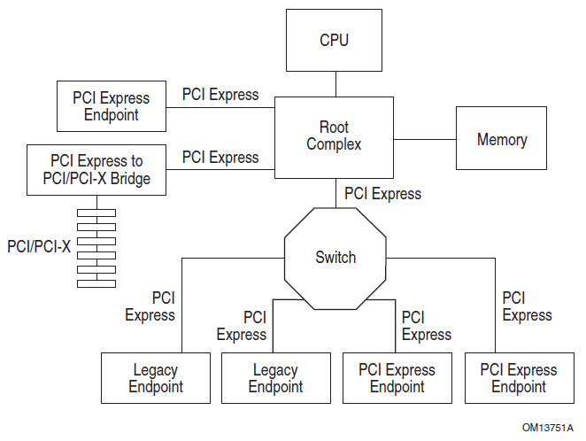
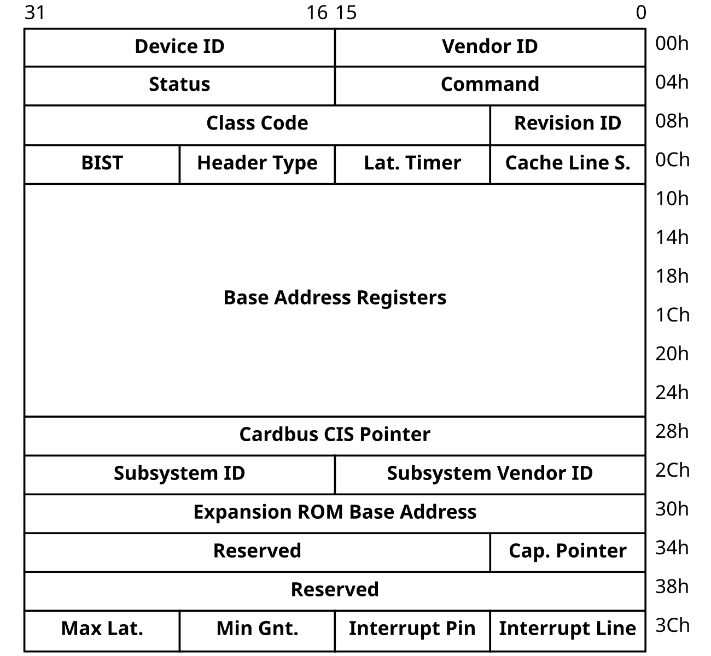
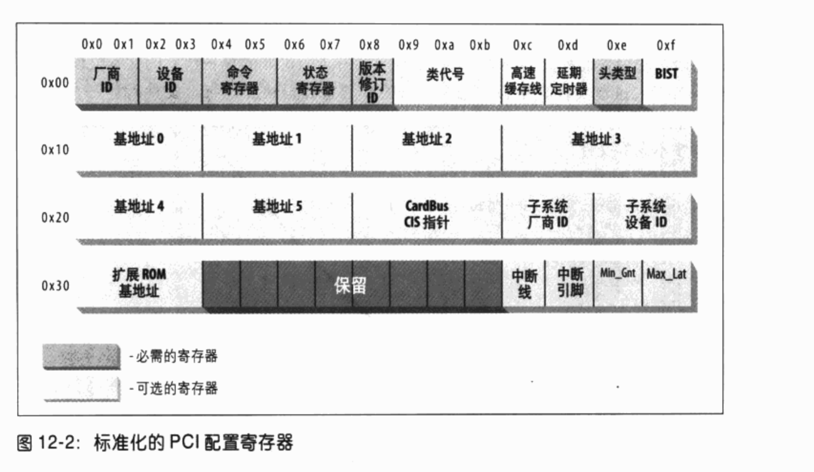
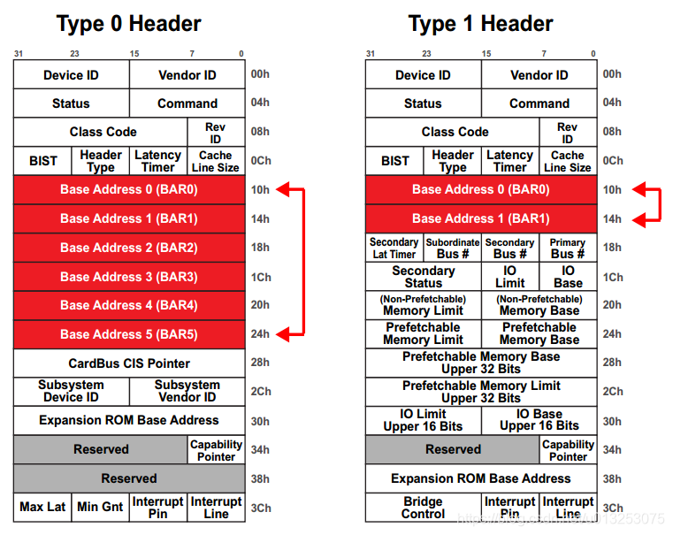
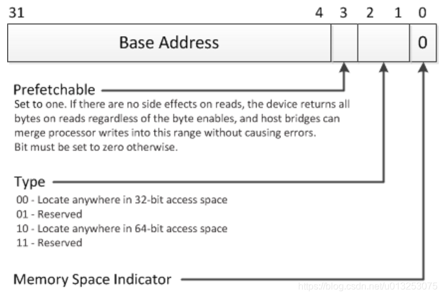
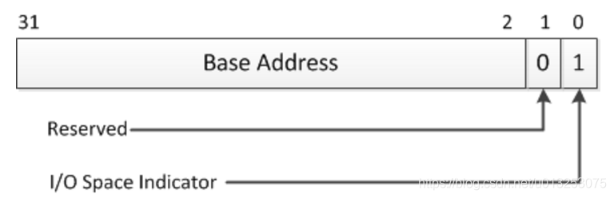

# vfio二次整理

## 上次遗留的问题
todo 
1. vfio_group的字段container_next
2. device的bar空间，PCI config space
3. iommu和domain的关系
4. gpu io-device的架构

### 1. contianer_next
```c
int vfio_container_attach_group(struct vfio_container *container,
				struct vfio_group *group)
{
    ...
	group->container = container;
	group->container_users = 1;
    ...
	list_add(&group->container_next, &container->group_list);
    ...
}
```


## pci pcie设备

pcie一般由5个部分组成
1. Root Complex
2. PCIe Bus
3. Endpoint
4. Port and Bride
5. Switch



### Root Complex
是整个设备的根节点，CPU通过它与PCIe的总线相连，并最终连接到所有的PCIe设备上

### PCIe 总线
PCIe上的设备通过PCIe总线互相连接

### PCIe Device
PCIe上连接的设备可以分为两种类型
1. Type 0：Endpoint 它表示一个PCIe上最终端的设备，比如我们常见的显卡，声卡，网卡等等
2. Type 1：它表示一个PCIe Switch或者Root Port，它的主要作用是用来连接其他的PCIe设备

### BDF（Bus Number, Device Number, Function Number）

每个pcie都有一个配置空间，内核通过读取这个知道设备的类型

PCIe上所有的设备，无论是Type 0还是Type 1，在系统启动的时候，都会被分配一个唯一的地址，它有三个部分组成：

Bus Number：8 bits，也就是最多256条总线
Device Number：5 bits，也就是最多32个设备
Function Number：3 bits，也就是最多8个功能

可以使用`lspci`查看BDF，格式是BN:DN:DN

### Type 0 Device和Endpoint

所有连接到PCIe总线上的Type 0设备（终端设备），都可以来实现PCIe的Endpoint，用来发起或者接收PCIe的请求和消息

**每个设备可以实现一个或者多个Endpoint，每个Endpoint都对应着一个特定的功能**

一块双网口的网卡，可以每个为每个网口实现一个单独的Endpoint；
一块显卡，其中实现了4个Endpoint：一个显卡本身的Endpoint，一个Audio Endpoint，一个USB Endpoint，一个UCSI Endpoint

###### RCIE（Root Complex Integrated Endpoint）
说到PCIe设备，脑海里面可能第一反应就是有一个PCIe的插槽，然后把显卡或者其他设备插在里面，就像我们上面看到的这样。但是其实系统中有大量的设备是主板上集成好了的，比如，内存控制器，集成显卡，Ethernet网卡，声卡，USB控制器等等。

这些设备在连接PCIe的时候，可以直接连接到Root Complex上面。这种设备就叫做RCIE（Root Complex Integrated Endpoint），如果我们去查看的话，他们的Bus Number都是0，代表Root Complex

###  Port / Bridge
那么其他的需要通过插槽连接的设备呢？这些设备就需要通过PCIe Port来连接了

在Root Complex上，有很多的Root Port，这些Port每一个都可以连接一个PCIe设备（Type 0或者Type 1）

本质上，所有这些连接其他设备用的部件都是由桥（Bridge）来实现的，这些桥的两端连接着两个不同的PCIe Bus（Bus Number不同）

比如，一个Root Port其实是靠两个Bridge来实现的：一个（共享的）Host Bridge（上游连接着CPU，下游连接着Bus 0）和一个PCI Bridge用来连接下游设备（上游连着的是Bus 0（Root Complex），下游连着的PCIe的设备（Bus Number在启动过程中自动分配））

### Switch
如果我们需要连接不止一个设备怎么办呢？这时候就需要用到PCIe Switch

PCIe Switch内部主要有三个部分：
1. 一个Upstream Port和Bridge：用于连接到上游的Port，比如，Root Port或者上游Switch的Downstream Port
2. 一组Downstream Port和Bridge：用于连接下游的设备，比如，显卡，网卡，或者下游Switch的Upstream Port
3. 一根虚拟总线：用于将上游和下游的所有端口连接起来，这样，上游的Port就可以访问下游的设备了

### configuration space
每个pcie都有一个配置空间，内核通过读取这个知道设备的类型




- type0和type1的configurae sapce的区别


一般有几个值
1. ventor id    硬件制造商
2. device id    制造商
3. class        每个设备属于一个类 
4. subsystem ventor ID
5. subsystem device ID
后面两个用于进一步识别设备，或有一些相似的设备

- BAR(base Address Register)
BAR 将设备的寄存器或内存区域映射到系统的物理地址空间，使CPU或DMA控制器能够通过读写内存地址访问设备

所有pcie设备都至少有256k的地址空间，其中前64字节是标准化的，其余是设备相关的

type1和type0的bar的数量是不一样的

系统中的每个设备中，对地址空间的大小和访问方式可能有不同的需求，例如，一个设备可能有256字节的内部寄存器/存储，应该可以通过IO地址空间访问，而另一个设备可能有16KB的内部寄存器/存储，应该可以通过基于MMIO的设备访问，系统软件将分配一个适当类 型(IO, NP-MMIO或P-MMIO)的可用地址范围给该设备

- Memory BAR寄存器的结构，图2是IO类型的BAR寄存器的区别如下



bit0:表示设备寄存器是映射到memory(0)还是IO(1)空间。
bit1: reserved 0
bit2: 在base adress register for Memory 中0表示32位地址空间，1表示64位地址空间。
bit3:在memory BAR中用来表示该设备是否允许prefetch，1表示可以预取，0表示不可以预区。
bit4~31:用来表示设备需要占用的地址空间大小

## SR-IOV概述

单根 I/O 虚拟化 (SR-IOV) 是 PCI SIG 的一项规范，它允许 PCI Express 设备表现为多个独立的物理 PCI Express 设备。SR-IOV 支持虚拟机 (VM) 之间高效共享 PCI 设备。它通过为每个虚拟机提供独立的内存空间、中断和 DMA 流，在无需使用虚拟机管理程序的情况下管理和传输数据

R-IOV架构包含两个功能：
1. 物理功能 (PF) 是一个功能齐全的 PCI Express 功能，可以像任何其他 PCI Express 设备一样被发现、管理和配置
2. 虚拟功能 (VF) 与物理功能 (PF) 类似，但无法进行配置，仅具备数据传输功能。VF 被分配给虚拟机

*推翻了之前的那个想法，让host os使用pf，因为vf是必须被pf管理的，所以必须有东西来管理pf，除非让corevisor来管理我的pf*

## vfio整理

