# Liux内核学习

看书以及源码所做的笔记
目前在看的书
《图解linux内核(基于linux6.x)》
《现代操作系统原理与实现》


## 一、linux内核概述

### linux内核组成
Linux内核的操作系统， 一般应该包含以下部分。
1. bootloader, 如GRUB和SYSLlNUX, 负责将内核加载进内存，系统上电或者BIOS初始化完成后执行。
2. init程序，负责启动系统的服务和操作系统的核心程序。
3. 必要的软件库(比如加载elf文件的id-linux.so), 支持C程序的库（比如GNU C Library,简称glibc, Android的B ionic。
4. 必要的命令和丁具， 比如shell命令和GNU coreutils包，提供常用的命令，coreutils是 GNU下的一个软件包，提供ls命令等

#### Android

android基于linux内核，在基础上搭建的从库到app的整体架构


Linux内核是整个架构的基础，它负责管理内存、电源 、文件系统和进程等核心模块，提供系统的设备驱动

Framework和类库是Android的核心，也是Android与其他以Linux内核为基础的操作系统的最大区别，它规定并实现系统的标准、接口，构建Android的框架，比如数据存储、显示、服务和应用程序管理等

## 二、linux内核设计模式和数据结构

### 关系数据结构

1. 一对一关系
一对一包括指针和内嵌两种关系
```c
// 指针
struct test_a {
    struct test_b* b;
};

struct test_b {
    struct test_a* a;
};

// 内嵌
struct test_b {
    struct test_a a;
};

```

2. 一对多关系
通常是链表，或者树
eg.
```c
struct branch {
    // sth
    struct leaf* head;
};

struct leaf {
    // sth
    struct leaf* next;
};
```
但是内核定义了`list_head`和`hlist_head`等数据结构和辅助函数帮我们实现所以可以直接使用list_head 来写这个多对多结构
```c
struct branch { 
    // sth
    struct list_head head;
};
struct leaf {
    //sth
    struct list_head node;
};
```


3. 多对多关系
   
从一对多的关系来说，可以将关系抽离出来

以老师学生的关系来说，一个老师可以有多个学生
```c
struct s_connection {
    struct list_head node;
    struct student *student;
};
```
以学生的角度来说，一个学生有多个老师
```c
struct t_connection {
    struct list_head node;
    struct teacher *teacher;
};
```
但是这个可以合并起来，因为如果是a是b的学生那么b肯定是a的老师
合并后的connection
```c
struct connection {
    struct list_head s_node;
    struct list_head t_node;
    struct teacher *teacher;
    struct student *student;
};
```
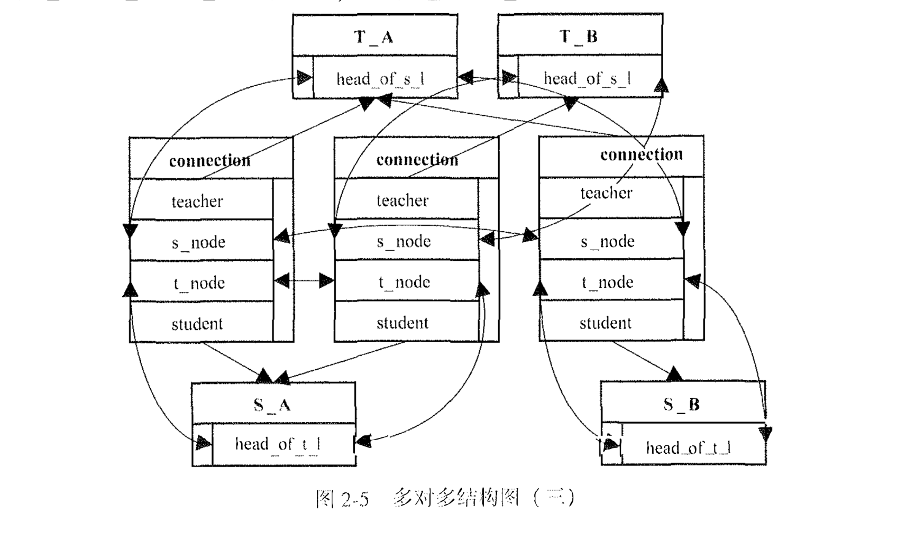

- 老师和学生的例子
eg
```
连接1: {老师A, 学生1}
连接2: {老师A, 学生2}
连接3: {老师B, 学生1}
连接4: {老师B, 学生3}


老师A的学生列表: 连接1 -> 连接2
老师B的学生列表: 连接3 -> 连接4

学生1的老师列表: 连接1 -> 连接3
学生2的老师列表: 连接2
学生3的老师列表: 连接4
```

但是不是所有关系都能合并，有些关系强行合并会造成一些麻烦

### 数据结构

#### 链表
最基本的就是`list_head`，定义如下
```c
struct list_head {
    struct list_head *next, *prev;
};

// list 函数表
LIST_HEAD(name);        // 初始化一个name的链表
INIT_LIST_HEAD(list);   // 初始化list
list_add(new, node);    // 在node后面添加new
list_add_tail(new, node);   // 在node前面插入new，如果 node == head，就插到尾部
list_empty(node);       // 判断链表是否为空，node 可以不是head
list_is_last(node);     // 判断node是否为最后一个
list_delete(node);      // 删除节点
list_entry(ptr, type, member);  // 通过list_head指针获取结构体 功能类似于contain_of ptr为list_head地址，type为结构体类型，member是结构体里面的list_head的变量名 
list_first_entry(ptr, type, member); // 获得ptr下一个node的结构体
list_for_each_entry(pos, head, member); // 遍历每一个type对象，pos为输出，表示当前循环中的对象的地址，type由实际的typeof(*pos)实现
list_for_each_entry_safe(pos, n, head, member); // 和上文一样，n作为零时变量，区别是如果这个删除node这个是安全的
```

还有一个实现方式，使用的是`hlist_head`和`hlist_node`，hlist_head是链表头，hlist_node是链表元素
```c
// 定义方式
struct hlist_head {
    struct hlist_node *first;
};
struct hlist_node {
    struct hlist_node *next, **prev;
};

// 函数表
HLIST_HEAD(name);       // 定义并初始化一个名字为 name 的链表
INIT_HLIST_HEAD(head);  // 初始化链表头
INIT_HLIST_NODE(node);  // 初始化链表元素
hlist_add_head(node, head);     // 将 node 作为链表的第一个元素插入链表
hlist_add_before(node, curr);   // 在 curr 前面插入 node
hlist_add_after(curr, node);    // 将 node 插入 curr 后面
hlist_empty(head);      // 链表是否为空
hlist_delete(node);     // 删除 node
hlist_entry(ptr, type, member); // ptr 为 hlist_node 的地址，type 为目标结构体名，member 是目标结构体内 hlist_node 对应的字段名，作用是获得包含该 hlist_node 的 type 对象
hlist_entry_safe(ptr, type, member);        // 意义同上，但会检测 ptr 是否为 NULL
hlist_for_each_entry(pos, head, member);    // 遍历链表的每一个元素，pos 是输出，表示当前循环中元素地址，type 实际由 typeof(*pos) 实现
hlist_for_each_entry_safe(pos, n, head, member); // n 起到临时存储的作用，其他同上；区别在于如果循环中删除了当前元素，xxx_safe 是安全的

```

### 设计模式

#### 模板方法设计模式
模板方法模式是一种行为型设计模式，它定义了一个操作中算法的骨架（模板），而将一些步骤延迟到子类中实现。这样，子类可以在不改变算法结构的情况下，重新定义某些步骤的具体实现


#### 观察者设计模式
观察者模式是一种类似于订阅的东西
流程
1. 个人读者或者报刊亭向报社发起订阅申请
2. 报社维护订阅列表
3. 新报印刷完毕，报社按照订阅发送报纸
4. 读者拿到报纸开始阅读，报刊拿到报纸开始售卖
   


观察者模式在内核中 使用频率很高， 我们在内核中看到类似xxx_listene1名字的函数多半都是观察者，类似xxx_notify名字的函数多半都是被观察者

#### 举例(input子系统)

linux的input子系统里面有两个使用场景，一个是device设备驱动，一个是handler，前者是用于接受device的数据，这些数据量都不是很大，然后handler就是用于处理这些input事件，一个input事件由一个input_value结构体表里，里面有type，code，value，三个字段分别表示事件的类型，事件码和值
- input子系统有两个核心数据结构，一个是input_dev，一个是input_handler，一个是设备驱动，一是操作，二者是多对多关系，所以使用input_handle来当中间变量

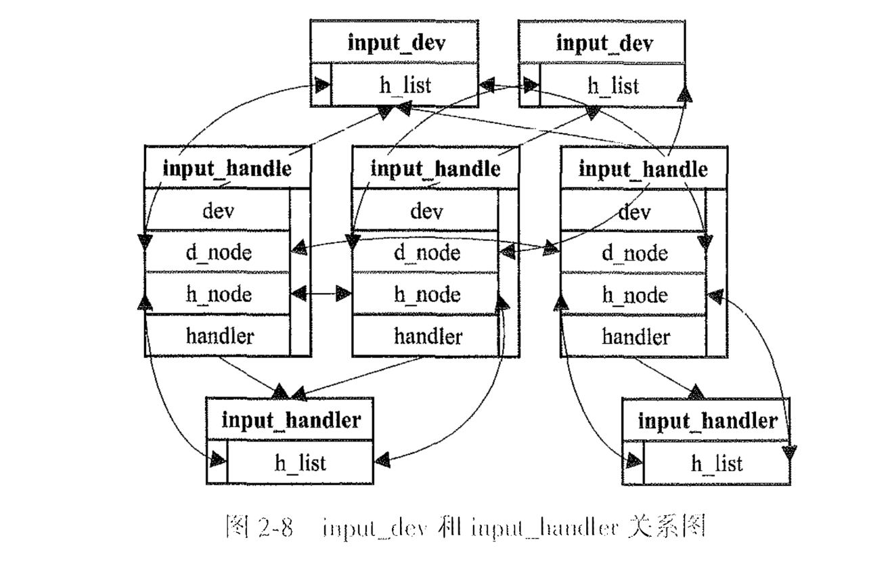

## 三、linux内存管理

### DRAM 和 MMIO
我们一般说内存是指内部存储器(RAM)，但是从cpu的角度来说不是，cpu的角度来说是连接在总线上的所有存储(广义上的存储)
cpu访问的物理地址并不一定落在主存，cpu不知道和他连接的是什么存储设备，也不关心，只需要能读取数据和能正确写入就行

内存空间包含多种存储，ram是其中一个，还包括很多外部io的设备的空间，会将设备映射到内存空间(MMIO)，可以通过`cat /proc/iomem`查看系统的内存空间布局

设备的寄存器和它的内存(RAM)都可以成为mmio的一部分，在x86里面，cpu访问mmio和内存一样，以gpu为例，一般它的寄存器空间和它自身的内存都会以MMIO的形式供CPU访问，CPU可以像访问指针一样访问他的寄存器和数据


1. 图中的信息和/proc/iomem的中看到的信息并不是完全对立的，实际上/proc/iomem反应的是一段内存的的用途，通常来说是哪些内存是mmio的，然后在这里面看他们在内存中的位置，比如PCI Bar和IOAPIC
2. 整个内存是空间一般并不是连续的，会用不到的Hole

- 内存管理本质上是维护内存介质(RAM+MMIO)、内存空间和虚拟内存三者的关系

- prot IO
prot IO是和MMIO一样的功能，但是port IO不占用内存空间，它是一个独立的空间，大小为64KB，访问pio需要专门的指令，比如x86的in/out，一个外设可以同时有mmio和pio

### 内存分页
linux涉及三种地址：虚拟地址(Vitual Address)，线性地址(Linear Address)和物理地址(Physical Address)
- 关系
虚拟地址经过分段变成线性地址，分段就是类16似于cs:ip addr=cs<<16 + ip
在使用mmu(Memeory Management Unit, MMU)的系统中，线性地址经过转换生成物理地址(分页)
- 分段
  分段是虚拟地址到线性地址的映射，linux对分段的支持十分有限，linux主要的四个分段是用户代码段(_USER_CS)，用户数据段(_USER_DS)，内核代码段(_KERNEL_CS)，内核数据段(_KERNEL_DS)，他们的段描述基址都为0，所以转化后的虚拟地址和线性地址相等
- 分页
  分页机制完成了线性内存到物理内存、的映射。 分页，字面上理解就是将内存逻辑上分为一页页的, CPU要访间某个地址， 必须先找到该地址所在的页。如何找到该页呢，该页的地址存在上一级页的项中；上一级页的地址存在再上 一级页的项中，依次类推，最高一级的页的地址存在CPU的寄存器中，cr3里面

#### 寻址方式

线性地址的本质是偏移量
- 页表 (Page Table)：用于寻址的目录。它是一个多级索引结构，存储了虚拟地址到物理地址的映射线索，一个页表的大小通常是一个页框
- 页框 (Page Frame)：内存的物理容器。它是物理内存中被划分的固定大小（通常 4KB）的块，真正存放数据的地方

- 寻址过程 (多级索引 -> 定位)
1. 拆分地址：线性地址（虚拟地址）被切分成多段，前几段用于逐级查表，最后一段用于页内偏移。
2. 逐级查找：以第一级页表地址为起点，用地址的高位段作为偏移，依次在内存中找到下一级页表的物理位置，直到找到最终页框（Base_final）的基地址。

- 计算物理地址：最终物理地址 = 最终页框基地址 + 线性地址的低 12 位。因为页框大小是4KB(2
12)，所以低 12 位正好代表了在页框内部的精确偏移量

由于页表和页框都是 4KB 对齐的，它们在物理内存中的起始地址低 12 位永远是 0。因此，在页表项中存储下一级地址时，不需要精确到字节，这 12 位可以用来存放权限标志等额外信息，节省空间，一个页表项是4字节

eg 如果有一个0xc0012345的地址
页目录项的地址 = cr3 + 0x300 * 4，因为一个页表项是4字节大小，该项包含了PTable地址的高20位
PTable的地址加上0x12 * 4可得到对应的页表项的物理地址，该页表项包含了最终页框的高20位地址
物理地址 = 页框地址 + 0x345

1. 该过程由MMU硬件完成，和软件没有关系，但是分页和软件是由关系的
2. 各级页表的项所包含的地址是物理地址
3. 如果不同虚拟地址映射到一个页框，那么这个就是共享内存
4. 多级页表的目的是为了节省内存，没有用到的内存就可以不映射


这种 32 = 10 + 10 + 12 的方式，虚拟地址最多只有4gb
x86将管脚变成36个，引入了PAE(物理地址拓展)
1. 页表项从4kb到8kb
2. 每级容纳的项从1024变成512
3. 页框大小支持4kb和2mb两种大小

- PAE 下的 3 级分页（标准模式）
适用场景：页框大小为 4KB。
地址划分：
32 位地址 = 2位（PDPT） + 9位（页目录） + 9位（页表） + 12位（页内偏移）
结构：
1. PDPT（Page Directory Pointer Table）：页目录指针表，由 CR3 寄存器指向。
2. 页目录（Page Directory）
3. 页表（Page Table）
4. 页内偏移（Offset）

- PAE 下的 2 级分页（大页模式）
适用场景：页框大小为 2MB。
地址划分：
32 位地址 = 2位（PDPT） + 9位（页目录） + 21位（页内偏移）
结构：
1. PDPT（Page Directory Pointer Table）
2. 页目录（Page Directory）
3. 页内偏移（Offset）
特点：无页表，页目录项直接指向 2MB 大页的物理起始地址。


#### 内存映射

上面说到，mmu只负责寻址，那么设置页表项的addr和attr就是由内核来负责

linux为了兼容32位和64位的平台将线性地址分为5个级别
- 分别是
1. 页全局目录(Page Global Directory PGD)
2. 页四级目录(Page 4th Directory P4D)
3. 页上级目录(Page Upper Directory PUD)
4. 页中级目录(Page Middle Direcorty PMD)
5. 和页表(Page Table PT)

如果硬件不兼容，实际上就没有五级

这几个目录有优先级，分别是，页全局目录，页表，页中级目录，页上级目录，用不到的项数为0
eg 32位的常规分页是 10 0 0 0 10，对应PAE的4kb页框(2+9+9)就是 2 0 0 9 9

| 缩写 | 描述 |
| --- | --- |
| pgd、p4d、pud、pmd | PGD、P4D、PUD、PMDPGD、P4D、PUD、PMD 的项 |
| pte | page table entry，页表项 |
| pfn | page frame number，页框号按照 4KB 每个页框，从 0 到物理内存最大值依次编号 |
| pg、ofs | page、offset |
| PTRS | 项的数目 |


内核函数宏

| 函数和宏       | 描述                                                         |
| -------------- | ------------------------------------------------------------ |
| xxx_index      | xxx 可以是 pgd、p4d、pud、pmd、pte，表示线性地址在对应级别内的偏移量 |
| xxx_offset     | xxx 可以是 pgd、p4d、pud 和 pmd，用来获取该级别目标偏移量对应的项的指针 |
| pte_offset_kernel | 意义同上                                                 |
| set_xxx        | xxx 可以是 pgd、p4d、pud、pmd、pte 设置项                   |
| xxx_pfn        | xxx 可以是 pgd、p4d、pud、pmd、pte，获取项指向的页框号       |
| pfn_xxx        | xxx 可以是 pud、pmd、pte，根据 pfn 和属性生成项的值，利用__xxx 完成 |
| __xxx          | xxx 可以是 pgd、p4d、pud、pmd、pte，根据一个整数值生成项的值 |
| xxx_val        | xxx 可以是 pgd、p4d、pud、pmd、pte，根据项的值生成一个整数   |
| xxx_clear      | xxx 可以是 pgd、p4d、pud、pmd、pte，清除项的值               |  

利用以上的函数和宏，可以完成软件上的分页任务，比如一个4kb的页框，框号是0x12，那么他的物理地址是0x12000，常规分页情况下设置的代码是
```c
// pgd pud pmd and pte ard all pointers, pfn is 0x12
// pgd
pgd_idx = pgd_index((pfn << PAGE_SHIFT) + PAGE_OFFSET);
pgd = pgd_base + pgd_idx;

// p4d pud and pmd
p4d = p4d_offset(pgd, 0);
pud = pud_offset(p4d, 0);
pmd = pmd_offset(pud, 0);

// page table
pte_ofs = pte_index((pfn << PAGE_SHIFT) + PAGE_OFFSET);
if (!(pmd_val(* pmd) & _PAGE_PRESENT)) {
    pte_t * page_table = (pte_t *)alloc_low_page();
    set_pmd(pmd, _pmd(_pa(page_table) | _PAGE_TABLE));
}

pte = pte_offset_kernel(pmd, pte_ofs);
set_pte(pte, pfn_pte(pfn, port));
```

这段代码是简单介绍如何将虚拟地址和物理地址映射到一起的思路，所以共享内存的原理就是把两个不一样的虚拟地址映射到同一个物理地址，mmu是知道内核的分页模式的(通过寄存器的配置)

#### GPU Framebuffer

如果程序需要访问GPU的显存，GPU内部有一个DMA，可以通过厂商的封装去访问这个东西，或者使用MMIO

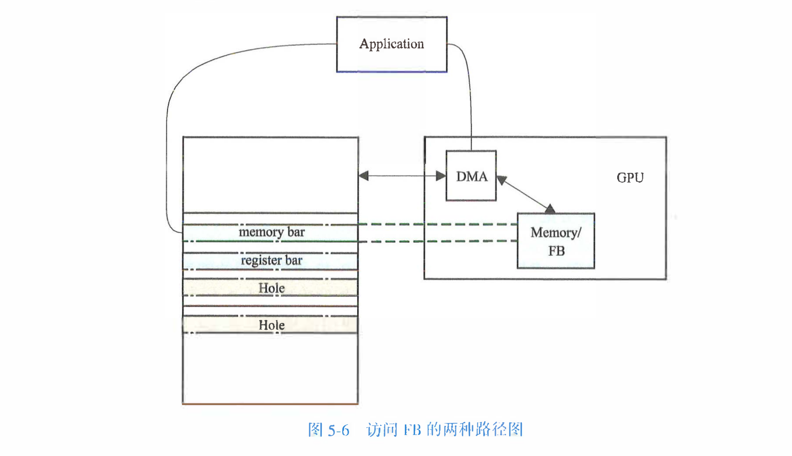

memorybar 将显存的一部分直接映射到内存空间中，我们可以直接映射需要访问的部分内存到虚拟空间，想访问普通内存一样直接访问

## 四、物理内存管理
### 物理内存的布局
- 物理内存是以页为单位管理的，内核提供了 page 结构体与一页物理内存对应，而一页物理内存的作用或者使用情况由它所在的区域 (zone) 决定，zone 的分布则决定于它所处的结点 (node)。需要说明的是，实际的物理内存并不是一页页的，页只是逻辑上的划分

#### node
node和NUMA架构(None Uniform Memory Access, 非同一方访问内存)有很大关系，传统SMP架构中，所有的CPU共享总线，限制了内存访问能力

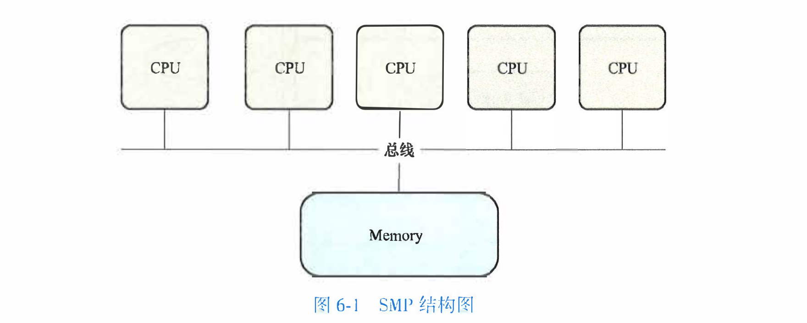

但是当cpu数量增加时，会争抢总线资源，导致性能瓶颈

NUMA结构
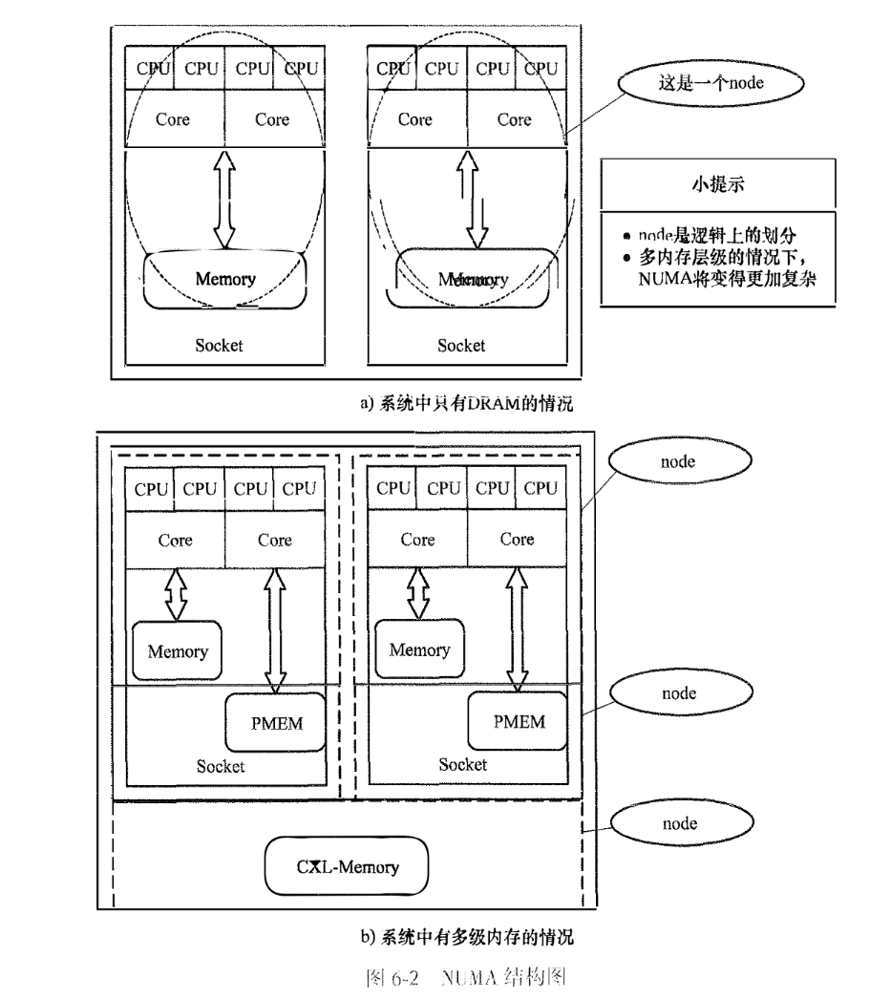

NUMA将cpu和内存分组，一个socket里有cpu和内存(dram)，同一个socket内cpu访问内存会比访问另一个socket里面的内存(remote，远端内存)，为了方便描述，现在叫这个为node

可以访问
```bash
ls /sys/devices/system/node/nodex # 看一个node里面的情况
```
系统种除了DRAM这种内存以外，还会存在多种内存，比如PMEM(Persistant MEM，非易失性内存，访问速度介于DRAM和外存之间)，近几年CXL也加入，所以node变得更复杂
cpu和dram组成一个node，pmem和cxl组成一个node，这样做的目的是为了cpu默认申请的是dram也就是最快的内存

- 内核是如何得到node信息的，是通过BIOS提供的ACPI的STAR和SLIT两个表
SRAT全称是System Resource Affinity Table，定义了资源的亲和性，其中包括 CPU 和内存。最重要的一个部分是 Static Resource Allocation Structure，它包含 Processor、Memory 等资源的亲和性结构（Affinity Structure）。Processor 和 Memory 的 Affinity Structure 内都包含 Proximity Domain 信息。显而易见，Proximity Domain 相等的资源会被分为一组，也就是同一个 node。

解决了 node 包含哪些资源的问题，那么node和node之间的 distance 就只能靠SLIT了。SLIT全称是 System Locality Information Table，它用一个二维数组（Entry）记录了 node 和 node 之间的距离。从内核启动到解析 SRAT 和 SLIT，最终生成每一个 node 对应的 pglist_data 对象

#### node管理
软件角度管理node

##### 数据结构
内核定义了pglist_data结构体和node对应，
主要字段
```c
node_zones          zone[MAX_NR_ZONES]      // node包含的zone的集合 数组
node_zonelists      zonelist[MAX_ZONELISTS] // 对所有node的zone的引用，本质是zoneref数组
node_mem_map        page*                   // node包含的物理内存页对应的page结构体 FLATMEM模式下 
node_start_pfn      unsigned long           // node物理内存的起始页框号
node_present_pages  unsigned long           // node包含的实际可用物理页数 不含hole
node_spanned_pages  unsigned long           // node跨越的物理页区间 含hole
```

同一个node上的访问效率是一样的，但是为了兼容性，将node进一步划分
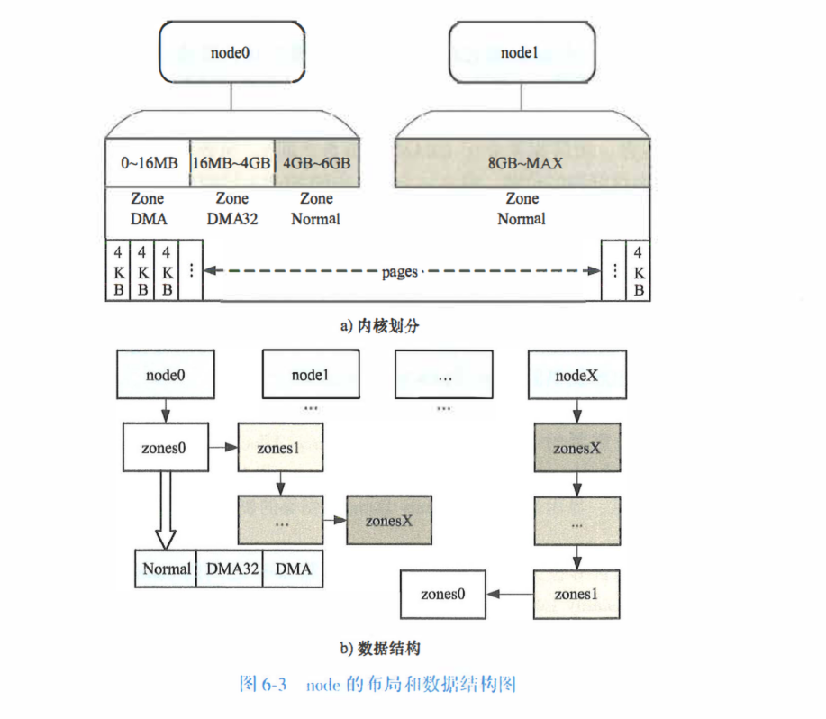

图中有dma dma32 normal三个zone的划分，dma和dma32是为了兼容老设备

申请内存的时候会优先从当前cpu所在的node分配内存(alloc_pages)，也可以指定node，所以pglist_data的node_zonelists维护了两个zonelist(本质上是zoneref数组)，分别是ZONELIST_FALLBACK和ZONELST_NO_FALLBACK

分配node的时候内存不足会尝试从其他node分配，这就是FALLBACK，但是如果指定某个node，内存不足失的时候 这就会NOFALLBACK

NOFALLBACK只需要维护自己node的zone就可，但是FALLBACK需要维护所有node的zone

除了指定node还可以指定zone，指定的zone没有足够的内存的情况下，继续尝试zonelist后面的zone，不制定默认分配normal zone

所以zonelist有两个要求
1. 一个node，zonelist代表的zoneref数组需要按照zone序号(zone_idx)来存储node的zone (比如zone_normal到zone_dma32到zone_dma)
2. 对于某个fallback的zonelist而言，zonered数组按照node距离从近到远的顺序来存储每一个node的zone

所以是
从高到底 从近到远

##### 内存模式
内核管理page的模式有三个 FLATMEM SPARSEMEM SPARSEMEN_VMEMMAP
三种模式 这三种模式叫内存模式

一个物理内存对应一个page，内核管理这些page思路是不变的，这个内存模式影响的是对物理内存的认定和page对象的管理方式不同，page和pfn(page_to_pfn和pfn_to_page)的不同

1. flat memory模式
flat就是把内存看作连续的，即使中间有洞，也会把hole计算在物理页里面，这些page会有page对象，只不过是不可用的，缺点就是hole多的时候会浪费很多空间

falt是平面，所以他把内存看作从min到max的平面，所以数据结构page用数组是最合理的

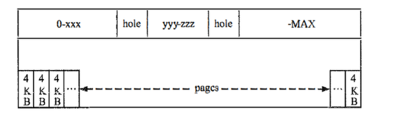

min和max是由系统初始化的时候确定的

内核定义了max_pfn，表示系统可用的内存的最大页框号

2. sparsemem
在numa架构中，node之间会有很大hole，所以sparesmem和sparsmem_vmemmap更适合这种情况
 
因为hole多，所以只为有效内存分配page对象，将内存逻辑上拆分成一个个section，每个section的大小和平台有关系，x86是64m，使能PAE是512m，x86_64是128m

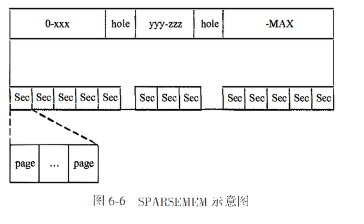

有了section就为每个有效的section分配page，每一个section有一个mem_section结构体维护他的page，mem_section指向section的内存对应的page对象

每个section里面有很多mem_section对象，那么是静态分配哈市动态分配这些对象呢，也就是是否需要为无效的section分配mem_section对象的问题

先说静态分配，内核定义了一个mem_section的二维数组
```c
struct mem_section mem_sectioon[NR_SECTION_ROOTS][SECTIONS_PER_ROOT];
```
这两个都是按照理论上的最大值来定义的，所以是足够的

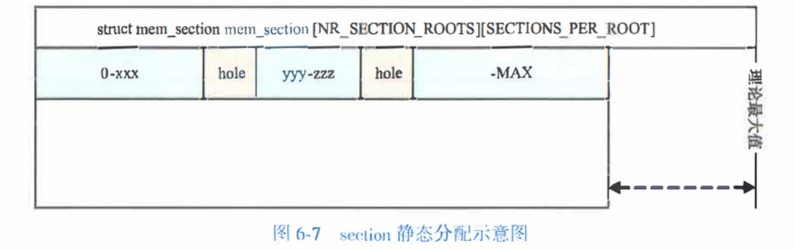

在CONFIG_SPARSEMEM_EXTREMEM的情况下，mem_section是动态分配的，mem_section是一个二级指针

但是动态分配的情况下section root占一页内存，能够存放4kb/sizeof(mem_section)个section，section root支持mask，所以mem_section结构体的大小必须是2的整数次幂

动态分配是以root为单位的，也就是一次分配一夜的内存，同一个root里面的scetion不需要重复申请

3. sparsemem_vmemmap模式

这个模式比2多的就是要求page对象的存储在虚拟地址的连续区间中，(对物理地址的连续性没有要求) 这段虚拟地址起始于vmcmmap所以对与某个物理页来说，它的pfn对应的page对象的虚拟地址就是vmemmap + (pfn)

既然虚拟地址是确定的，最后实现就是申请物理地址，然后映射到虚拟地址上


### 物理内存申请的三个阶段

#### 启动程序
物理内存是稀缺资源，必须严格有限的管理它被高效管理，这方面的问题是内存碎片化

内存碎片化是系统运行的时候，进程不断的申请和释放内存，导致空闲页面趋于散落在不连续的区间的情况

内核在不同阶段的内存管理方式不同，主要是memblock和buddy

用途为usable的内存空间是直接由内核管理(MMIO除外)，除了memblock和buddy系统，还有一个更高级的是启动程序如grub，grub可以通过参数，来限制内核可以管理的内存上线，也就是说高于这个限制部分的内存不归memblock和buddy管理，同样memblock可以保留一部分内存，剩下的部分才由buddy系统管理

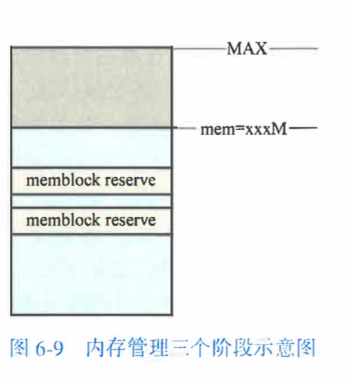

#### memblock分配器

memblock之前还有个分配器bootmem，不过已经剔除

memblock就是把内存分成一块一块的，用memblock_region表示一块内存，base和size分别表示起始地址和大小，块用数组的方式进行维护，由memblock_type的region表示，内核有两个memblock_type 一个表示可用的内存，一个表示预留的内存，由memblock的memory和reserved字段表示

memblock提供一些函数
```c
memblock_add()        // 加块到 memory 数组
memblock_reserve()    // 预留块，加入 reserved 数组
memblock_free()       // 释放块，从 reserved 数组删除
memblock_remove()     // 从 memory 数组删除，很少用
```

memblock是内存管理的第一个阶段，之后会由buddy系统接管内存管理
交接的过程是在mem_init里面 会调用函数释放highmem和lowmem到buddy系统

只有在memory数组里面和不在reserve数组里面的块才会进入buddy系统，buddy是由grub和memblock筛选剩下来的内存

#### 伙伴系统

基本思想是 将内存分块管理，但是块的大小是以页为单位，有2^0 到 2^10 共11种大小，在内核中用阶(order) 来表示块的大小

内存申请优先从小块开始是自然的，释放一个块的时候，如果它的伙伴也处于空闲状态，那么就将二者合并成一个更大的块，合并后的块如果它的伙伴也空闲，那么就继续合并，以此类推

成为伙伴的两个块的条件
1. 两个块必须相邻
2. 互为伙伴的两个块的阶必须相等
3. 他们的地址必须是2^n对齐的，第一个页框的地址，合并之后的地址是2^n+1的地址对齐的

推论
1. 给定一个块，它的伙伴的位置是确定的

##### 数据结构
page的上一级是zone，块是由zone来记录的，zone的free_area字段是一个大小等于MAX_ORDER的free_area结构体数组，数组的每一个对应伙伴系统当前所有大小为某个阶的块，阶的值等于数组下标，free_list字段是一个链表，将每个块的首个页给串起来，

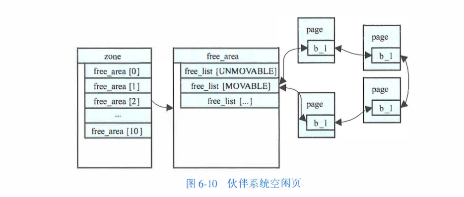

unmobable   内核代码，驱动所使用的页，位置固定，搬不走
moveable    用户进程的页，可以迁移
reclaimable 文件缓存等，可以直接回收

伙伴系统只维护空闲的页，已经分配出去的块不再属于伙伴系统，只有被释放后的才会进入伙伴系统

一个块可以使用它的第一个页和order表示

##### 页的申请和释放

```c
alloc_page() alloc_pages()  // 申请一页 多页
alloc_pages_node()          // 优先从指定的node申请多页内存
free_page() free_pages()
__free_page() __free_pages()    // 释放一页 多页内存
```

free_page 和 __free_page参数是不一样的

分配入口
```c
__alloc_pages() {
    prepare_alloc_pages() {     // 准备参数
        get_page_from_freelist();   // 遍历 zonelist尝试分配
    }
    // 失败
    __alloc_pages_slowpath();       // 内存回收/规整后重试
}
```

- 水位线 watermark

zone的警线 分配后该zone剩余空闲页低于水位线，拒绝分配或触发回收

剩余页 ≥ HIGH  -> 随便分
HIGH > 剩余 ≥ LOW  -> 普通申请可以，但可能唤醒 kswapd 回收
LOW > 剩余 ≥ MIN  -> 只有高优先级(GFP_ATOMIC等)能分
剩余 < MIN  -> 只有紧急情况(OOM)能分


- pcp(per_cpu_pages)缓存
每个cpu本地缓存一些order=0 1 2 3的小块，避免每次都去抢zone级别的锁

申请 order < 3 -> 先从本 CPU 的 pcp 缓存取
               -> 缓存不够 -> 从 buddy 批量拿一批补货
申请 order > 3  -> 直接走 buddy 系统


### 搭建物理内存管理系统
如果想要自己管理内存，不经过伙伴系统，有三种方案

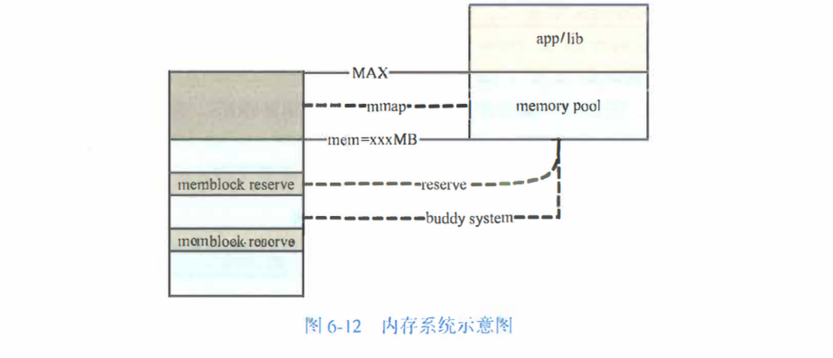

1. grub分离一部分内存，没有移植性，对物理内存大小也有要求
2. 使用mmblock_reserve预留内存 该方案需要修改内核代码，在普通外设驱动中无法实现，因为加载驱动时伙伴系统已经初始化完毕
3. 使用huge tlb也是一种方案


## 五、设备管理
### 计算机设备的连接和通信
#### 总线(bus)
设备一般通过bus和cpu通信，常见的总线有AMBA，PCIe等，设备和bus的工频率一般低于cpu
1. AMBA总线

arm上的片上总线是级微控制器总线结构(AdvancedMicro-controller-Bus-Archiecture , MBA)规范，该规范定义了ARM架构片上系统(System-on-chip Soc)的通信标准，AMBA可以将arm处理器和其他ip盒进行集成，比如arm和fpga

AMBA包括三组总线
- 高级高性能总线（Advanced High-Performance Bus, AHB）：用于连接其他高性能 IP 核、片上和片外内存以及中断控制器等高性能模块
- 高级系统总线（Advanced System Bus, ASB）：用于某些不必使用 AHB 但同时又需要高性能特性的芯片中，能起到一部分降低功耗的作用
- 高级设备总线（Advanced Peripheral Bus, APB）：用于连接低速的设备，作为低功耗的精简接口总线

2. PCI总线
   组件互连（Peripheral Component Interconnect， PCI）标准，通过pci插槽连接，每个pci设备有一个唯一识别编号，包括总线号(bus number)，设备号(device number)，功能号(function number)

   当数据传输速率过高时，PCI 所采用的并行线路间会相互干扰。PCIe（PCI Express） 使用了基于数据包的串行连接协议，其相比于 PCI 总线来说带宽更高，同时保持了 PCI 设备驱动的前向兼容性

#### 设备类型

设备按照总线大致可以分为以下几类
1. pci pcie设备
2. usb设备
3. iic spi低速设备
4. platform设备

##### pci pcie设备

pcie一般由5个部分组成
1. Root Complex
2. PCIe Bus
3. Endpoint
4. Port and Bride
5. Switch


###### Root Complex
是整个设备的根节点，CPU通过它与PCIe的总线相连，并最终连接到所有的PCIe设备上

###### PCIe 总线
PCIe上的设备通过PCIe总线互相连接

###### PCIe Device
PCIe上连接的设备可以分为两种类型
1. Type 0：Endpoint 它表示一个PCIe上最终端的设备，比如我们常见的显卡，声卡，网卡等等
2. Type 1：它表示一个PCIe Switch或者Root Port，它的主要作用是用来连接其他的PCIe设备

一个pcie设备可以只有一个功能(Function)，即Func0，也可以有多个功能，多功能设备(Multi-Fun)，但是一个设备必须要有Func0，其他7个功能是是可选的
*不管Pcie有多少个功能，每一个功能都有一个唯一独立的配置空间(Configuration Space)*

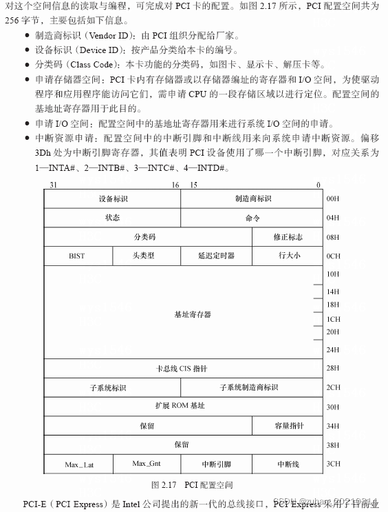

###### BDF（Bus Number, Device Number, Function Number）

每个pcie都有一个配置空间，内核通过读取这个知道设备的类型

PCIe上所有的设备，无论是Type 0还是Type 1，在系统启动的时候，都会被分配一个唯一的地址，它有三个部分组成：

Bus Number：8 bits，也就是最多256条总线
Device Number：5 bits，也就是最多32个设备
Function Number：3 bits，也就是最多8个功能

可以使用`lspci`查看BDF，格式是BN:DN:DN

###### Type 0 Device和Endpoint

所有连接到PCIe总线上的Type 0设备（终端设备），都可以来实现PCIe的Endpoint，用来发起或者接收PCIe的请求和消息

**每个设备可以实现一个或者多个Endpoint，每个Endpoint都对应着一个特定的功能**

一块双网口的网卡，可以每个为每个网口实现一个单独的Endpoint；
一块显卡，其中实现了4个Endpoint：一个显卡本身的Endpoint，一个Audio Endpoint，一个USB Endpoint，一个UCSI Endpoint

###### RCIE（Root Complex Integrated Endpoint）
说到PCIe设备，脑海里面可能第一反应就是有一个PCIe的插槽，然后把显卡或者其他设备插在里面，就像我们上面看到的这样。但是其实系统中有大量的设备是主板上集成好了的，比如，内存控制器，集成显卡，Ethernet网卡，声卡，USB控制器等等。

这些设备在连接PCIe的时候，可以直接连接到Root Complex上面。这种设备就叫做RCIE（Root Complex Integrated Endpoint），如果我们去查看的话，他们的Bus Number都是0，代表Root Complex

######  Port / Bridge
那么其他的需要通过插槽连接的设备呢？这些设备就需要通过PCIe Port来连接了

在Root Complex上，有很多的Root Port，这些Port每一个都可以连接一个PCIe设备（Type 0或者Type 1）

本质上，所有这些连接其他设备用的部件都是由桥（Bridge）来实现的，这些桥的两端连接着两个不同的PCIe Bus（Bus Number不同）

比如，一个Root Port其实是靠两个Bridge来实现的：一个（共享的）Host Bridge（上游连接着CPU，下游连接着Bus 0）和一个PCI Bridge用来连接下游设备（上游连着的是Bus 0（Root Complex），下游连着的PCIe的设备（Bus Number在启动过程中自动分配））

###### Switch
如果我们需要连接不止一个设备怎么办呢？这时候就需要用到PCIe Switch

PCIe Switch内部主要有三个部分：
1. 一个Upstream Port和Bridge：用于连接到上游的Port，比如，Root Port或者上游Switch的Downstream Port
2. 一组Downstream Port和Bridge：用于连接下游的设备，比如，显卡，网卡，或者下游Switch的Upstream Port
3. 一根虚拟总线：用于将上游和下游的所有端口连接起来，这样，上游的Port就可以访问下游的设备了

###### configuration space
每个pcie都有一个配置空间，内核通过读取这个知道设备的类型


- type0和type1的configurae sapce的区别


一般有几个值
1. ventor id    硬件制造商
2. device id    制造商
3. class        每个设备属于一个类 
4. subsystem ventor ID
5. subsystem device ID
后面两个用于进一步识别设备，或有一些相似的设备

###### BAR(base Address Register)
BAR 将设备的寄存器或内存区域映射到系统的物理地址空间，使CPU或DMA控制器能够通过读写内存地址访问设备

1. 从设备角度，bar是内部寄存器的编号，设备只知道访问了第几个位置，然后就把数据交付出去
2. 从系统角度来说，bar是系统给设备分配的门牌号，系统启动后在物理地址里面给每个设备都分配一个地址范围，把起始地址放到写进bar，CPU访问这段地址，硬件会自动把请求路由到对应设备上
3.  CPU访问 驱动先通过 ioremap把物理地址映射成虚拟地址，然后在代码里读写这个虚拟地址，MMU把它转成物理地址，硬件发现这个地址落在 MMIO 区域，就把请求转发到 PCIe总线上，最终到达设备对应的寄存器

**所有pcie设备都至少有256k的地址空间，其中前64字节是标准化的，其余是设备相关的**

*type1和type0的bar的数量是不一样的*

系统中的每个设备中，对地址空间的大小和访问方式可能有不同的需求，例如，一个设备可能有256字节的内部寄存器/存储，应该可以通过IO地址空间访问，而另一个设备可能有16KB的内部寄存器/存储，应该可以通过基于MMIO的设备访问，系统软件将分配一个适当类 型(IO, NP-MMIO或P-MMIO)的可用地址范围给该设备

- 多个bar的关系
多个 BAR 是互相独立的，各自映射设备内部不同的功能区域 *以显卡为例*
1. BAR0 (256MB, MMIO)  -> GPU 控制寄存器（命令、状态、引擎控制）
2. BAR1 (256MB, MMIO)  -> Frame Buffer（显存，存放画面数据）
3. BAR2 (16MB, MMIO)   -> MMIO 寄存器扩展
4. BAR3 (IO BAR, 256B) -> 传统 VGA IO 端口兼容

- Memory BAR寄存器的结构，图2是IO类型的BAR寄存器的区别如下


bit0:表示设备寄存器是映射到memory(0)还是IO(1)空间。
bit1: reserved 0
bit2: 在base adress register for Memory 中0表示32位地址空间，1表示64位地址空间。
bit3:在memory BAR中用来表示该设备是否允许prefetch，1表示可以预取，0表示不可以预区。
bit4~31:用来表示设备需要占用的地址空间大小

###### bar和bar空间

设备在系统的PCI地址空间里申请一段来用，所申请的空间基址和大小保存在BAR基址寄存器里
*BAR里的只是PCI域的地址空间，需要映射到IO地址空间里或者内存空间里之后软件才能使用*

##### ACS 规范
ACS 是 PCIe 规范里面的一个可选功能，解决 PCIe switch下游的设备之间不能p2p通信

- acs的 device id table
pcie switch/root port 内部会有一个路由控制器，核心作用是

如果siwtch收到一个tlp(PCIe 事务包) 需要判断
1. 这个包是向上游走还是下游，到另一个设备
2. 如果是向下游，acs会判断这个p2p是不是被允许的

acs的控制位包括
1. ACS Source Validation：检查请求的发起者(Requester ID = BDF)是否合法
2. ACS Translation Blocking：阻止未经过地址翻译的 DMA 请求 (必须走 IOMM)）
3. ACS P2P Request Redirect：把设备间的 P2P 请求重定向到上游(Root Port)，强制经过IOMMU 检查
4. ACS Upstream Forwarding：控制上游转发行为
 

#### 可编程io
cpu通常以读写寄存器的方式和设备进行通信，一个设备有多个寄存器，可以在内存地址或者io地址间访问
- 设备寄存器有三个类型
    1. 控制寄存器: 接受驱动程序的命令
    2. 状态寄存器: 反馈设备的工作状态
    3. 输入/输出寄存器: 用于驱动和设备之间的数据交互
- 设备访问寄存器有两种方式
    1. 内存映射 MMIO(Memory-Mapped I/O)，将设备直接映射到内存空间，有独立的内存地址，读写内存指令即可控制设备 (todo1 本质)
    2. 端口映射 PMIO(Port-Mapped I/O)，通过端口操作指令和设备交互
    - 这两个统称 (PIO Programm I/O)

#### DMA
直接访问内存(Direct Memory Access, DMA)是一种在设备和内存之间高效传输的方式，和PIO不同，PIO需要cpu参与主动搬运数据，但是DMA允许设备绕过cpu直接读写内存

DMA的发起者可以是cpu也可以是设备，设备发起dma的过程
  1. 设备驱动在内存中申请一段DMA缓冲区
  2. 发起DMA请求
  3. 设备通过dma将数据拷贝到DMA缓冲区
  4. 拷贝完成设备触发中断通知cpu对缓冲区的数据进行处理

##### DMA控制器
在某些架构中，DMA的发起还需要DMA控制器的参与，DMA控制器和cpu和内存在同一系统总线上，有DMA控制器发起DMA的过程
  1. cpu向控制器发送DMA缓冲区的位置和长度，以及数据传输的方向，之后放弃总线的控制权
  2. 控制器获得总线权限，然后将设备的数据拷贝到内存
  3. 完成后控制器向cpu发送中断，cpu重新获得总线控制权
  - 如果是设备发起DMA那就是先通知控制器

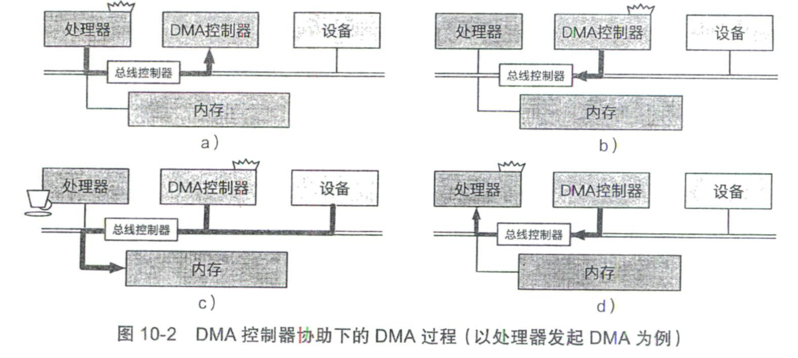  

有些架构可以让设备直接获得总线的控制权然后进行操作
    
##### iommu (todo 2)
大多数情况下，cpu上执行的操作系统代码在进行内存访问时使用的是虚拟地址(virtualaddress)，并通过 MMU 翻译成物理地址(physical address）)，设备进行 DMA 时访问的内存地址是总线地址(bus address)，其不同于虚拟地址和物理地址，当操作系统向 DMA 控制器注册 DMA 内存缓冲区时，需要填写的是总线地址，设备和内存之间的iommu(Input-Output Memory Management Unit，IOMMU)会负责将总线地址翻译成物理地址

在一些场景下设备使用的总线地址和物理地址相同。由于 DMA 在进行过程中会向连续的地址写入数据，因此操作系统需要分配连续的物理内存作为 DMA 缓冲区。IOMMU 的存在免除了 DMA 缓冲区各内存页必须物理连续的限制，同时 IOMMU 还限定了设备可以访问到的物理内存范围

- IOMMU 的另一个重要用途是为操作系统提供内存访问保护机制，用于防止恶意设备以及驱动对物理内存的非法访问。此外，IOMMU 还可用于在虚拟化环境中防止恶意虚拟机通过设备对其他虚拟机和虚拟机监控器内存进行非法访问

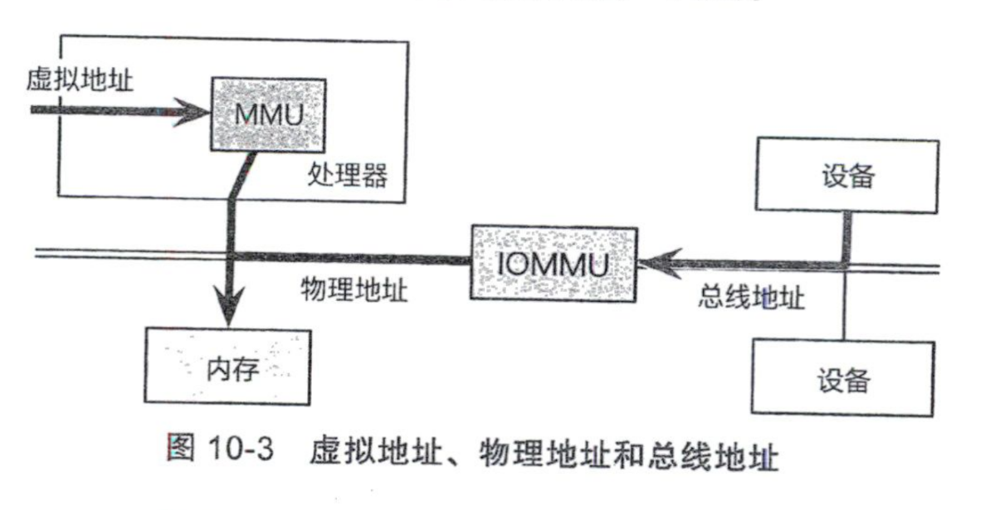

### 设备的识别

#### 设备树
由于arm设备种类太多，硬件配置硬编码到系统代码中的方式非常不灵活，所以引入设备树

设备树(device tree)是描述计算机硬件信息的数据结构。设备树里面包含了cpu的名称，内存，总线，设备等硬件信息，好处是不同平台下的设备可以使用相同的系统镜像并且只需要修改设备树信息就行

设备树不是对所有设备信息都进行描述，通常是只有不能被动态探测的设备才使用设备树，比如设备树通常不会包含pci设备的信息

设备树代码(devices tree source)描述了计算机设备的树状结构，每个节点都有一个节点描述并且挂在根节点下，这种结构叫(device tree blob)

#### ACPI

识别设备的另一个方案是高级配置和电源接口(Advanced Configuration and Power Interface)，简称ACPI，这是x86平台上计算机设备的标准识别方案，该层抽象统＿地向操作系统汇报硬件设备的情况同时提供管理设备的接口和方法

ACPI可以分成两部分
1. ACPI表: ACPI提供了大量的表结构信息这些信息描述了当前计算机系统的各种状态，包括多处理器信息、NUMA的配置信息等
2. ACPI运行:ACPI提供了ACPI机器语言（ACPI Machine Language 简称AML）操作系统可以解释执行AML代码和底层的固件进行交互，进而完成对设备的识别和相应配置功能

ACPI还负责计算机整体系统、各个处理器以及不同设备的电源和温度的管理

#### ACPI 和 设备树
- 共同点
ACPI和设备树均使用树状结构对设备信息和层次关系进行描述

- 区别
设备树描述的仅仅是一种of的关系即当前计算机系统拥有哪些设备。而ACPI除了描述当前计算机的设备信息之外还能通过AML代码直接控制设备的行为

arm平台也能使用ACPI，因为windows是不支持设备树的

### 设备的中断管理
#### 中断控制器
虽然可以使用MMIO来访问设备，但是设备执行是需要一定时间的，要知道device什么时候执行完成，使用轮询会特别麻烦，所所以采用中断，为了响应中断，还需要中断处理函数

CPU使用特定的物理地址作为中断引脚来接收中断，但是这样限制了中断的设别和数量，随着数量和种类的增加，arm引入了中断管理器

#### arm中断控制器
todo

## 六、虚拟化 kvm
虚拟化是一种资源管理技术，在主机上创建虚拟机， 用户可以在其数据服务器、计算机或主机上创建多个虚拟机

客户机(guest os，就是俗称的虚拟机)，是运行在主机(host os)上的，一个主机可以运行多个虚拟机，这个就需要一个虚拟机管理程序，叫做hypervisor又叫vmm(Virtual Machine Monitor)或者virtualer

### hypervisor
hypervisor又分两类
1. hypervisor直接运行在裸机上(Native or Bare-Metal)，它直接运行在实际的硬件上，管理guest os
2. hypervisor运行在操作系统上，和其他程序没有区别。hypervisor是作为host os上的一个进程存在的，guest os是在host os的基础上抽象来的
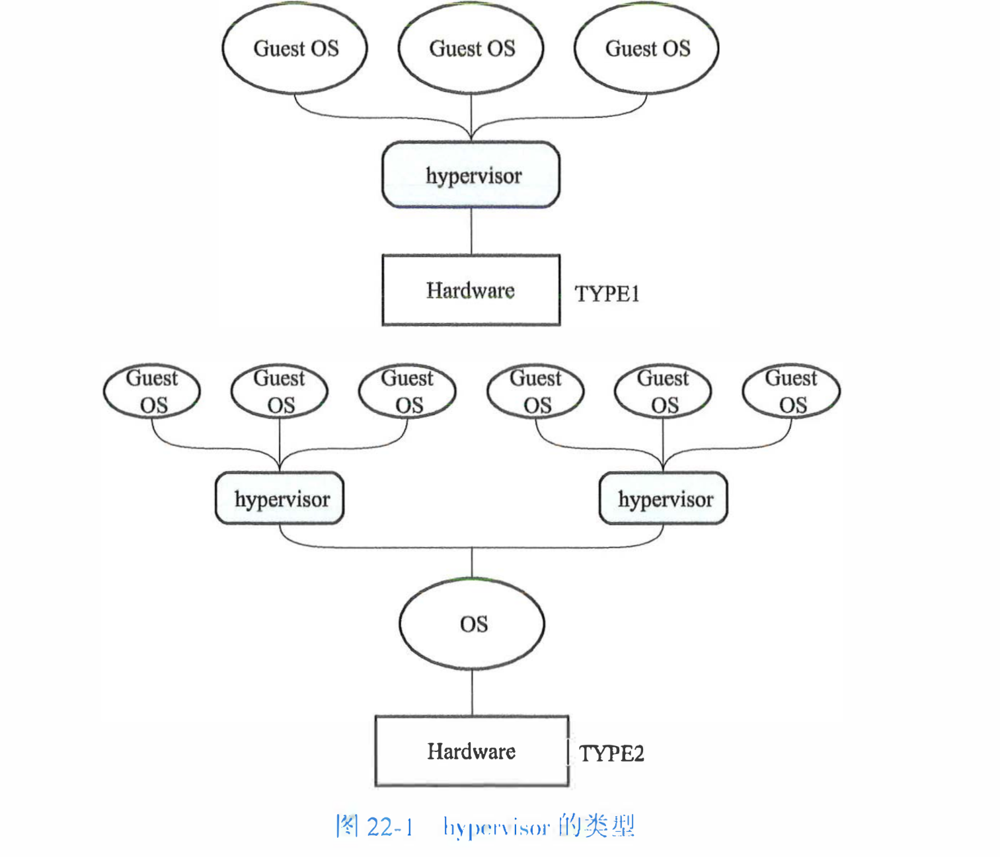

### kvm基本原理
编译出来的程序在虚拟机上运行的情况分两种
1. guest os和host os架构不同，这个时候需要做指令翻译
2. guest os和host os架构相同，这个时候可以选择指令翻译也可以选择硬件加速，kvm就是硬件加速的方案之一


kvm(Kernel-Based Virtual Machine)，在linux中是内核的一部分，可以实现cpu和内存虚拟化，但是kvm不是一个纯软件的方案，需要硬件支持，比如intel-V 和 AMD-V

硬件方案实现的cpu虚拟化(vcpu)，但是没有实现io和设备虚拟化，相关io和设备的指令会推出kvm然后转到其他程序执行，比如qemu，然后回到kvm继续执行

加载完kvm.ko会创建 /dev/kvm文件，用户空间是用ioctl的方式和kvm交互

- 简单交互逻辑

```c
#include <fcntl.h>
#include <unistd.h>
#include <sys/ioctl.h>
#include <sys/mman.h>
#include <linux/kvm.h>

#define MAX_BIN_SIZE 0x1000

int kvm_fd, vm_fd, vcpu_fd, bin_fd;
int ret;
struct kvm_sregs sregs;
struct kvm_regs regs;
struct kvm_userspace_memory_region mem;
struct kvm_run *kvm_run;
void *userspace_addr;
long mmap_size;

kvm_fd = open("/dev/kvm", O_RDWR);
vm_fd = ioctl(kvm_fd, KVM_CREATE_VM, 0);
vcpu_fd = ioctl(vm_fd, KVM_CREATE_VCPU, 0);
bin_fd = open("my_binary.bin", O_RDONLY);

userspace_addr = mmap(NULL, MAX_BIN_SIZE, PROT_READ | PROT_WRITE, MAP_SHARED | MAP_ANONYMOUS, -1, 0);
read(bin_fd, userspace_addr, MAX_BIN_SIZE);

mem.slot = 0;
mem.flags = 0;
mem.guest_phys_addr = 0;
mem.memory_size = MAX_BIN_SIZE;
mem.userspace_addr = (unsigned long)userspace_addr;
ioctl(vm_fd, KVM_SET_USER_MEMORY_REGION, &mem);

mmap_size = ioctl(kvm_fd, KVM_GET_VCPU_MMAP_SIZE, NULL);
kvm_run = mmap(NULL, mmap_size, PROT_READ | PROT_WRITE, MAP_SHARED, vcpu_fd, 0);

ioctl(vcpu_fd, KVM_GET_SREGS, &sregs);
sregs.cs.base = 0;
sregs.cs.selector = 0;
ioctl(vcpu_fd, KVM_SET_SREGS, &sregs);

memset(&regs, 0, sizeof(struct kvm_regs));
regs.rip = 0;
ioctl(vcpu_fd, KVM_SET_REGS, &regs);

while (1) {
    ioctl(vcpu_fd, KVM_RUN, NULL);
    
    switch(kvm_run->exit_reason) {
        case KVM_EXIT_HLT:
            goto exit;
        case KVM_EXIT_EXCEPTION:
            break;
        default:
            break;
    }
}

exit:
close(kvm_fd);
close(bin_fd);
return 0;

```
前五步准备工作，包括创建vcpu，建立内存映射等，第六步bin运行在vcpu上，特殊的指令导致kvm推出后，KVM_RUN返回，然后处理这个终止，后面让vcpu继续执行


### kvm的具体实现
KVM_RUN会触发目标代码执行在vcpu上，在AMD-V的SVM(Secure Virtual Machine)模式中，最终会执行VMRUN指令，使cpu进入一个特殊的模式 guest mode

### intersept
在这个模式下，cpu正常执行指令，只不过会拦截需要处理的异常和我们希望被拦截的指令，比如io，当拦截后，cpu会保存执行状态到内存中(VMCB, virtual machine control block)
intercept列表也存 在VMCB内，发生Intercept后， exit code也存储在VMCB中

硬件上的exit code和实例程序中的宏不一样，是通过一个svm_invoke_exit_handler函数来转换的，这个是amd架构的执行方式

### cpu虚拟化
1. 用户空间配置执行环境
2. 通过KVM_RUN ioctl启动cpu虚拟化
3. cpu进入guest模式，执行我配置的指令
4. 如果cpu执行了intercept的列表中的指令，或者外部环境导致interctpt发生，cpu保存状态，推出guest mode，记录exit code
5. kvm接手处理exit code 将 exit code变成exit_reson
6. 返回用户空间，查看exit_reson并做进一步处理
7. 循环2 - 6这几个步骤


### kvm和qemu
qemu并不依赖kvm实现虚拟化，在没有kvm支持的情况下，qemu有一个TCG(Tiny Code Generator)做指令翻译，将需要运行的指令翻译成当前cpu可执行的指令

在有kvm的支持下，可以不需要tcg，kvm负责cpu和内存的虚拟化，然后qmeu负责io，设备的虚拟化
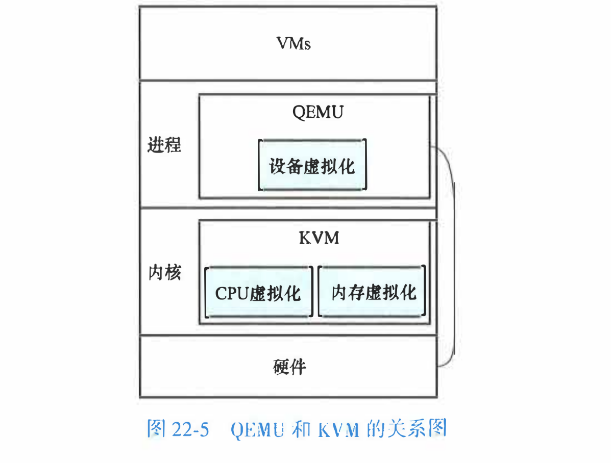

### 设备虚拟化
设备虚拟化，分为两类
1. 纯虚拟化，对于guet os来说，这类设备和物理设备没有区别
2. 半虚拟化，设备会根据约定告诉guest os自己是虚拟的，二者通过约定的方式通信，可以根据guestos进行性能优化，但是缺点是需要改动guest os，定制驱动
   


#### virtio
virio是一种半虚拟化的方案
关于设备是如何告诉guest os是一个虚拟virtio设备的，其实是在设备端和驱动中实现的
- eg 如果是virtioPCI设备，设备端添加vendor id = PCI_VENDOR_lD_REDHAT_QUMRANET的设备，驱动端可以直接匹配

双方是通过共享内存进行交互的，这个共享内存是用ring buffer进行管理


1. 驱动将descriptor和它们的信息写入ring buffer
2. 驱动提醒设备端ring buffer更新了，
3. 设备从ring buffer读取信息
4. 解析信息，处理驱动请求，比如将数据复制到指定的地址
5. 设备将结果写回ring buffer
6. 设备端通过中断通知驱动更新完毕，驱动处理中断

驱动写入，设备读取；设备写入，驱动读取

#### SR-IOV概述

单根 I/O 虚拟化 (SR-IOV) 是 PCI SIG 的一项规范，它允许 PCI Express 设备表现为多个独立的物理 PCI Express 设备。SR-IOV 支持虚拟机 (VM) 之间高效共享 PCI 设备。它通过为每个虚拟机提供独立的内存空间、中断和 DMA 流，在无需使用虚拟机管理程序的情况下管理和传输数据

R-IOV架构包含两个功能：
1. 物理功能 (PF) 是一个功能齐全的 PCI Express 功能，可以像任何其他 PCI Express 设备一样被发现、管理和配置
2. 虚拟功能 (VF) 与物理功能 (PF) 类似，但无法进行配置，仅具备数据传输功能。VF 被分配给虚拟机


#### vfio
##### 基础概念
- vfio是虚拟化硬件加速方案中的其中一个方案
- vfio是一个设备直通(pass-through)技术，用户态可以直接用过使用vfio驱动直接访问硬件，这个过程是基于IOMMU保护的，iommu可以把设备io，中断，dma等能力呈现给用户态

##### 原理
vfio使用DMA remapping和Interrupt remapping，DMA remapping使用iommu限制设备的io访问，Interrupt remapping使用中断重映射做中断隔离

##### iommu
iommu是一种内存管理单元（MMU），它将具有直接存储器访问能力（可以DMA）的I/O总线连接至主内存，iommu将设备可见的虚拟地址（在此上下文中也称设备地址或I/O地址）映射到物理地址。部分单元还提供内存保护功能，防止故障或恶意的设备
iommu使用iommu guest os可以直接访问gpa(guest physical address)就不访问hpa(host physical address)，iommu维护gpa或者iova到hpa的映射

##### group
iommu和vfio都有group的概念，两者几乎是一样的
iommu对dma的隔离的单位是group，group可以只有一个或多个devices，如果一个设备可以绕过iommmu和其他设备通信，比如p2p(peer to peer)，就不能独立成一个group

##### container
多个group可以绑定到一个vfio container，共享iommu的上下文，比如iova到hva的映射

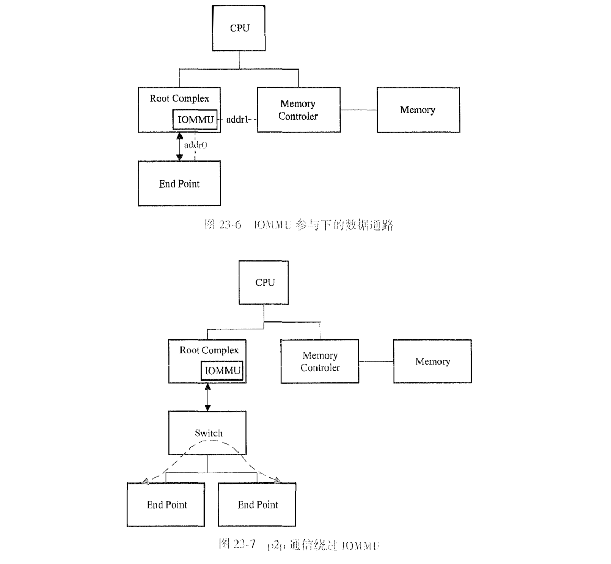

- vfio使用样例
```c
int container, group, device;
struct vfio_group_status group_status = { .argsz = sizeof(group_status) };
struct vfio_iommu_type1_info iommu_info = { .argsz = sizeof(iommu_info) };
struct vfio_iommu_type1_dma_map dma_map = { .argsz = sizeof(dma_map) };
struct vfio_device_info device_info = { .argsz = sizeof(device_info) };

container = open("/dev/vfio/vfio", O_RDWR);
group = open("/dev/vfio/18", O_RDWR);
ioctl(group, VFIO_GROUP_SET_CONTAINER, &container);
ioctl(container, VFIO_SET_IOMMU, VFIO_TYPE1_IOMMU);
ioctl(container, VFIO_IOMMU_GET_INFO, &iommu_info);

// 将group加入到container中
ioctl(group, VFIO_GROUP_SET_CONTAINER, &container);
ioctl(container, VFIO_SET_IOMMU, VFIO_TYPE1_IOMMU);
ioctl(container, VFIO_IOMMU_GET_INFO, &iommu_info);

// 建立iova到hpa的映射
dma_map.vaddr = mmap(0, 1024 * 1024, PROT_READ | PROT_WRITE,
                     MAP_PRIVATE | MAP_ANONYMOUS, 0, 0);
dma_map.size = 1024 * 1024;
dma_map.iova = 0;
dma_map.flags = VFIO_DMA_MAP_FLAG_READ | VFIO_DMA_MAP_FLAG_WRITE;
ioctl(container, VFIO_IOMMU_MAP_DMA, &dma_map);
```

##### vfio驱动
上面样例代码中的container group device分别对应vfio里面的 vfio_container vfio_group vfio_device

- 调用栈
```
ioctl()系统调用
vfio_fops_unl_ioctl
vfio_iommu_type1_ioctl
vfio_iommu_type1_map_dma
vfio_pin_map_dma
vfio_iommu_map
iommu_map
```


## 七、半虚拟化(PV)

需要修改客户端虚拟机的源代码就是半虚拟化(para-virtualization)

半虚拟化需要对客户操作系统与虚拟机监视器进行协调设计，一方面，hypervisor为虚拟机提供超级调用(hypercall)，hypercall和系统调用类似，涵盖了调度，内存，IO多方面的功能，另一方面需要修改客户操作系统的代码，替换不可虚拟化的指令，改为hypercall

xen就是半虚拟化的代表之一

半虚拟化的优势
1. 更高的性能
2. 缓解语义鸿沟问题，半虚拟化技术可以获取虚拟机内部的状态，提高资源分配效率
