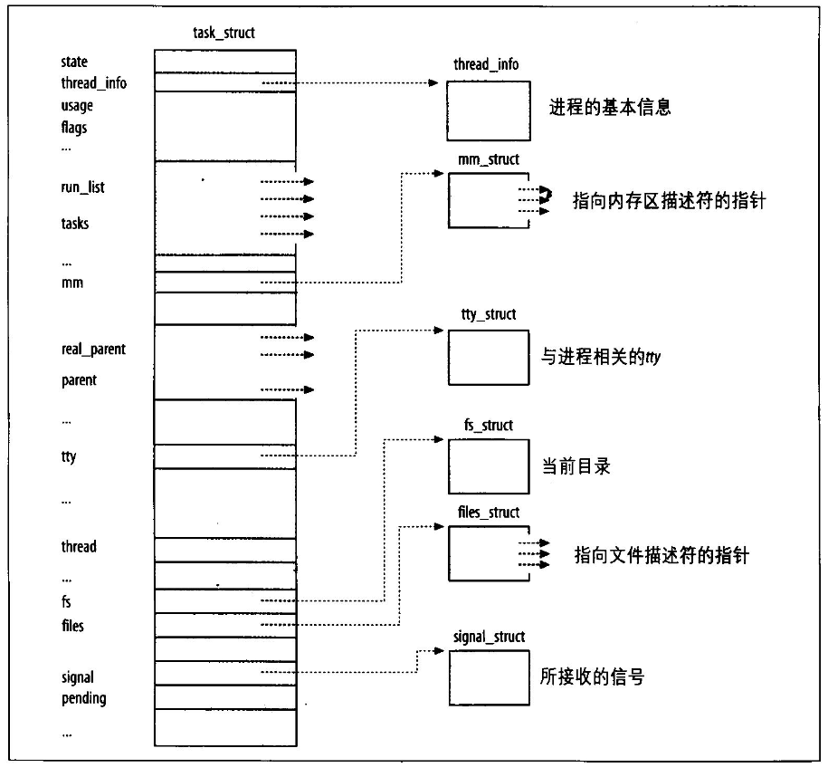
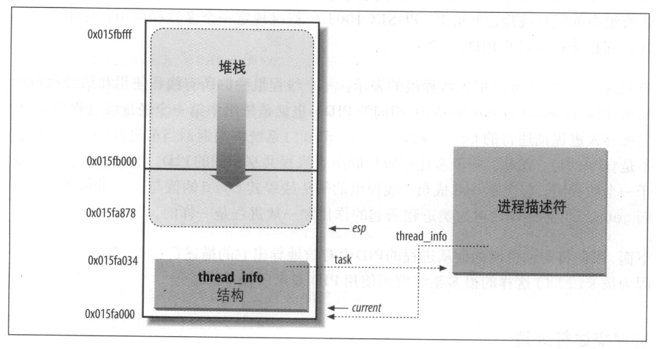

### 内核模块学习

#### 一、进程

进程是程序执行时的一个实例，进程是分配系统资源的实体

##### 1) 进程描述符

- task_struct

  管理进程 描述进程的实体



```c
// 主要的成员变量

// 进程标识
pid_t pid;                      // 进程ID
pid_t tgid;                     // 线程组ID（主线程PID）
char comm[TASK_COMM_LEN];       // 进程名

// 描述进程关系
struct task_struct *parent;     // 父进程（接收SIGCHLD）
struct task_struct *real_parent;// 真正的父进程（可能是调试器）
struct list_head children;      // 子进程链表
struct list_head sibling;       // 兄弟进程链表
struct task_struct *group_leader;// 线程组领导者

// 进程状态
unsigned int __state;           // 进程状态（TASK_RUNNING等）
int exit_state;                 // 退出状态（EXIT_ZOMBIE等）
int exit_code;                  // 退出代码
unsigned long flags;            // 进程标志（PF_*）

// 进程调度
int prio;                       // 动态优先级
int static_prio;                // 静态优先级
int normal_prio;                // 归一化优先级
unsigned int policy;            // 调度策略（SCHED_NORMAL等）
const struct sched_class *sched_class; // 调度类
struct sched_entity se;         // CFS调度实体
struct sched_rt_entity rt;      // 实时调度实体
struct list_head run_list;      // 运行队列链表
struct task_group *sched_task_group; // 调度组

// 内存管理
struct mm_struct *mm;           // 内存描述符（用户空间）
struct mm_struct *active_mm;    // 活动内存描述符（内核线程可能借用）

// 资源管理
struct files_struct *files;     // 打开文件表
struct fs_struct *fs;           // 文件系统信息
struct signal_struct *signal;   // 信号处理结构
struct sighand_struct __rcu *sighand; // 信号处理函数
struct vm_area_struct *mmap;    // 内存区域链表
struct mm_struct *mm;           // 用户空间内存描述符

// 时间和统计
u64 utime;                      // 用户态运行时间
u64 stime;                      // 内核态运行时间
unsigned long nvcsw;            // 自愿上下文切换计数
unsigned long nivcsw;           // 非自愿上下文切换计数
struct task_cputime cputime_expires; // CPU时间到期值

// 其他重要成员
struct thread_struct thread;    // 架构特定的线程信息
void *stack;                    // 内核栈指针
struct list_head tasks;         // 全局进程链表节点
struct nsproxy *nsproxy;        // 命名空间代理
struct user_struct *user;       // 用户资源限制
```

###### 1. 进程状态

在描述符中state的字段，在linux中各个状态是互斥的，只能设置一种状态

1. **可运行状态 (TASK_RUNNING)**

   进程要么在 CPU 上执行，要么准备执行

2. **可被中断的等待状态 (TASK_INTERRUPTIBLE)**

   进程被挂起（睡眠），直到某个条件变为真。产生一个硬件中断，释放进程正等待的系统资源，或传递一个信号都是可以唤醒进程的条件

3. **不可中断状态 (TASK_UNINTERRUPTIBLE)**

   与可中断的等待状态类似，但有一个例外，把信号传递到睡眠进程不能改变它的状态。这种状态很少用到，但在一些特定的情况下（进程必须等待，直到一个不能被中断的事件发生），这种状态是很有用的。例如，当进程打开一个设备文件，其相应的设备驱动程序开始探测相应的硬件设备时会用到这种状态。探测完成以前，设备驱动程序不能被中断，否则，硬件设备会处于不可预知的状态

4. **暂停状态 (TASK_STOPPED)**

   进程的执行被暂停。当进程接收到 SIGSTOP、SIGTSTP、SIGTTIN 或 SIGTTOU 信号后，进入暂停状态

5. **跟踪状态 (TASK_TRACED)**

   进程的执行被 debugger 程序暂停。当一个进程被另一个进程监控时（例如 debugger 执行 ptrace() 系统调用监控一个测试程序），任何信号都可以把这个进程置于 TASK_TRACED 状态

 还有两个状态既可以用state表示也可以用exit_state表示，只有进程终止的时候，进程的状态才会变成这两个的其中一种

6. **僵死状态 (EXIT_ZOMBLE)**

   进程的执行将被终止，但是父进程还没有调用wait4()或者waitpid()，返回进程死亡的信息，在wait之前，内核不能删除进程描述的数据，因为有可能父进程还需要

7. **僵死撤销状态 (EXIT_DEAD)**

   最终状态，父进程刚发出wait4()或者waitpid()，进而进程由系统删除，为了防止其他线程也调用wait执行

**设置state函数**

```c
// 可以直接赋值
p->state = xxx;
// 也可调用宏
set_task_state();
set_current_state();
```

###### 2. pid 和 tgid

一个进程由唯一的进程标识符process ID表示，这个上限是32767，由一个pidmap-array位图管理，pid的上限可以通过写入/proc/sys/kernel/pid_max这个文件来修改

每一个线程组都有一个共用的pid，领头线程的pid和tgid的值是一样的，getpid()返回的值其实是tgid的值而不是pid的值

###### 3. 进程描述符处理

在线程堆栈后面往往跟一个小的数据结构线程描述符thread_info，在旧版本中指向task_struct，task_struct中也有一个结构指向thread_info



esp寄存器是cpu栈顶指针，内核刚切换到内核态后，esp寄存器指向栈的顶端

要访问到task_struct只需要访问到thread_info，通过esp访问到thread_info，然后访问thread_info中的成员变量就行了

可以使用current_thread_info()这个宏

###### 4. 进程链表

task_struct 里面包含的list_head

#### 二、内核数据结构

#####  1) list 双向链表

- 定义

```c
struct list_head {
    struct list_head *next, *prev;
};
```

- 操作函数及宏定义

```c
list
LIST_HEAD(name)  		// 用于声明链表的标记（sentinel）
INIT_LIST_HEAD(struct list_head *list) 	// 用于在进行动态分配时，通过设置链表字段 next 和 prev，来初始化链表的标记
list_add(struct list_head *new, struct list_head *head) 	// 将 new 指针所引用的元素添加到 head 指针所引用的元素之后
list_add_tail(struct list_head* new, struct list_head *head)		// 插入new到head之前
list_del(struct list_head *entry)  	// 删除属于列表的 entry 地址处的项目
list_entry(ptr, type, member) 	 	// 返回列表中包含元素 ptr 的类型为 type 的结构，该结构中具有名为 member 的成员。
list_for_each(pos, head) 使用 pos    // 作为游标来迭代列表
list_for_each_safe(pos, n, head)	// 使用 pos 作为游标，n 作为临时游标来迭代列表。此宏用于从列表中删除项目
```

- `list_entry`实现原理

~~~bash
#define list_entry(ptr, type, member) container_of(ptr, type, member)

#define container_of(ptr, type, member) ({                      \
        const typeof( ((type *)0)->member ) *__mptr = (ptr);    \
        (type *)( (char *)__mptr - offsetof(type,member) );})
#实际上就是减去偏移地址
~~~

##### 2) spinlock_t 自旋锁

- 定义

```c
typedef struct spinlock {
     struct rt_mutex_base    lock;
#ifdef CONFIG_DEBUG_LOCK_ALLOC
     struct lockdep_map  dep_map;
#endif
} spinlock_t;
```

- 操作方法

~~~c
#include <linux/spinlock.h>

DEFINE_SPINLOCK(lock1);
spinlock_t lock2;

spin_lock_init(&lock2);

spin_lock(&lock1);
/* 临界区（critical region） */
spin_unlock(&lock1);

spin_lock(&lock2);
/* 临界区 */
spin_unlock(&lock2);
~~~

##### 3) mutex 互斥锁

- 定义

```c
struct mutex {
        atomic_long_t           owner;
        spinlock_t              wait_lock;
#ifdef CONFIG_MUTEX_SPIN_ON_OWNER
        struct optimistic_spin_queue osq; /* Spinner MCS lock */
#endif
        struct list_head        wait_list;		// 有一个等待队列
#ifdef CONFIG_DEBUG_MUTEXES
        void                    *magic;
#endif
#ifdef CONFIG_DEBUG_LOCK_ALLOC
        struct lockdep_map      dep_map;
#endif
};
// 其实是用spinlock实现的
```

- 操作方法

```c
#include <linux/mutex.h>

/* 互斥锁初始化函数 */
void mutex_init(struct mutex *mutex);
DEFINE_MUTEX(name);

/* 互斥锁获取函数 */
void mutex_lock(struct mutex *mutex);

/* 互斥锁释放函数 */
void mutex_unlock(struct mutex *mutex);
```


##### 4) acomic_t 原子变量

- 定义

```c
typedef struct {
        int counter;
} atomic_t;
// 其实就包含了一个int
```

- 操作函数

```c
#include <asm/atomic.h>

void atomic_set(atomic_t *v, int i);
int atomic_read(atomic_t *v);
void atomic_add(int i, atomic_t *v);
void atomic_sub(int i, atomic_t *v);
void atomic_inc(atomic_t *v);
void atomic_dec(atomic_t *v);
int atomic_inc_and_test(atomic_t *v);
int atomic_dec_and_test(atomic_t *v);
int atomic_cmpxchg(atomic_t *v, int old, int new);
```

原子变量的实现和架构有关，比如在x86架构上，实现的原理就是在汇编上使用lock

- 原子位操作函数

```c
#include <asm/bitops.h>

void set_bit(int nr, void *addr);
void clear_bit(int nr, void *addr);
void change_bit(int nr, void *addr);
int test_and_set_bit(int nr, void *addr);
int test_and_clear_bit(int nr, void *addr);
int test_and_change_bit(int nr, void *addr);
```
