# Liux内核学习

看书以及源码所做的笔记
目前在看的书
《图解linux内核(基于linux6.x)》
《现代操作系统原理与实现》


## 一、linux内核概述

### linux内核组成
Linux内核的操作系统， 一般应该包含以下部分。
1. bootloader, 如GRUB和SYSLlNUX, 负责将内核加载进内存，系统上电或者BIOS初始化完成后执行。
2. init程序，负责启动系统的服务和操作系统的核心程序。
3. 必要的软件库(比如加载elf文件的id-linux.so), 支持C程序的库（比如GNU C Library,简称glibc, Android的B ionic。
4. 必要的命令和丁具， 比如shell命令和GNU coreutils包，提供常用的命令，coreutils是 GNU下的一个软件包，提供ls命令等

#### Android

android基于linux内核，在基础上搭建的从库到app的整体架构
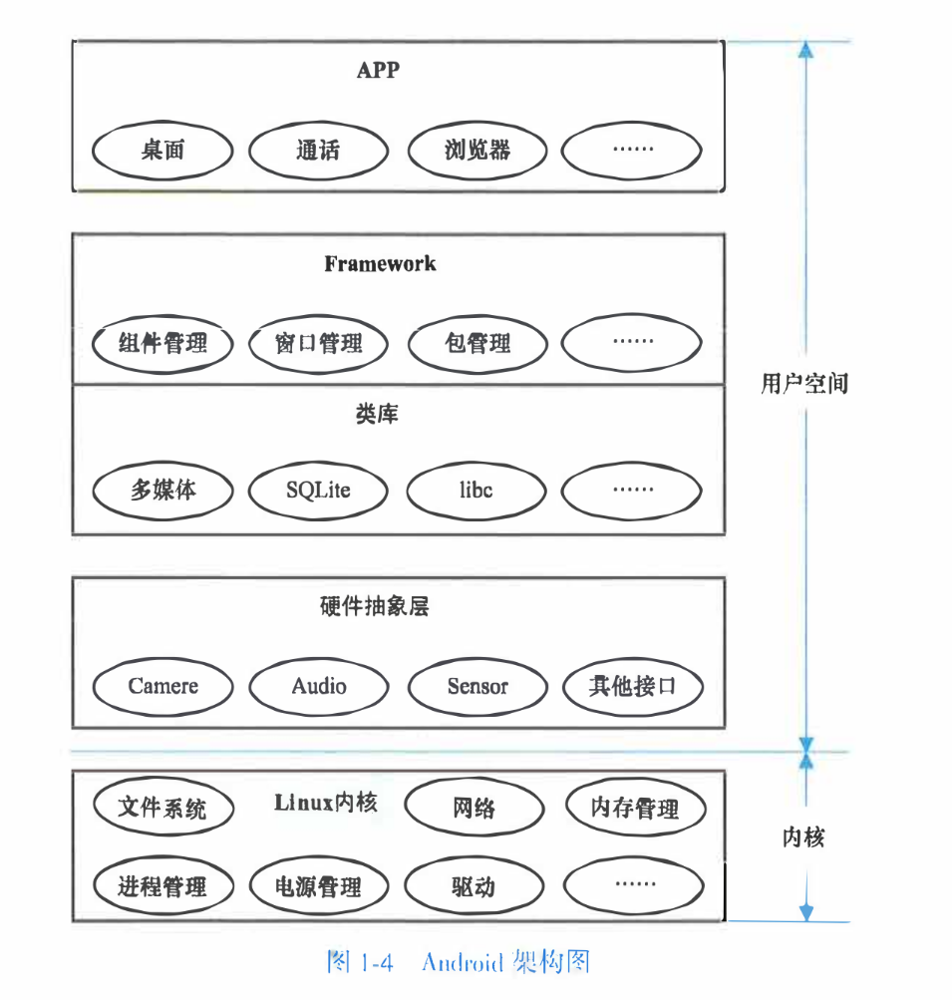

Linux内核是整个架构的基础，它负责管理内存、电源 、文件系统和进程等核心模块，提供系统的设备驱动

Framework和类库是Android的核心，也是Android与其他以Linux内核为基础的操作系统的最大区别，它规定并实现系统的标准、接口，构建Android的框架，比如数据存储、显示、服务和应用程序管理等

## 二、linux内核设计模式和数据结构

### 关系数据结构

1. 一对一关系
一对一包括指针和内嵌两种关系
```c
// 指针
struct test_a {
    struct test_b* b;
};

struct test_b {
    struct test_a* a;
};

// 内嵌
struct test_b {
    struct test_a a;
};

```

2. 一对多关系
通常是链表，或者树
eg.
```c
struct branch {
    // sth
    struct leaf* head;
};

struct leaf {
    // sth
    struct leaf* next;
};
```
但是内核定义了`list_head`和`hlist_head`等数据结构和辅助函数帮我们实现所以可以直接使用list_head 来写这个多对多结构
```c
struct branch { 
    // sth
    struct list_head head;
};
struct leaf {
    //sth
    struct list_head node;
};
```

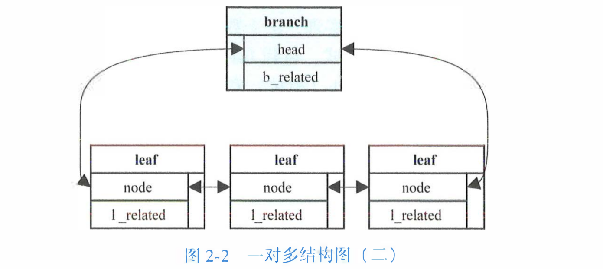

3. 多对多关系
   
从一对多的关系来说，可以将关系抽离出来

以老师学生的关系来说，一个老师可以有多个学生
```c
struct s_connection {
    struct list_head node;
    struct student *student;
};
```
以学生的角度来说，一个学生有多个老师
```c
struct t_connection {
    struct list_head node;
    struct teacher *teacher;
};
```
但是这个可以合并起来，因为如果是a是b的学生那么b肯定是a的老师
合并后的connection
```c
struct connection {
    struct list_head s_node;
    struct list_head t_node;
    struct teacher *teacher;
    struct student *student;
};
```


- 老师和学生的例子
eg
```
连接1: {老师A, 学生1}
连接2: {老师A, 学生2}
连接3: {老师B, 学生1}
连接4: {老师B, 学生3}


老师A的学生列表: 连接1 -> 连接2
老师B的学生列表: 连接3 -> 连接4

学生1的老师列表: 连接1 -> 连接3
学生2的老师列表: 连接2
学生3的老师列表: 连接4
```

但是不是所有关系都能合并，有些关系强行合并会造成一些麻烦

### 数据结构

#### 链表
最基本的就是`list_head`，定义如下
```c
struct list_head {
    struct list_head *next, *prev;
};

// list 函数表
LIST_HEAD(name);        // 初始化一个name的链表
INIT_LIST_HEAD(list);   // 初始化list
list_add(new, node);    // 在node后面添加new
list_add_tail(new, node);   // 在node前面插入new，如果 node == head，就插到尾部
list_empty(node);       // 判断链表是否为空，node 可以不是head
list_is_last(node);     // 判断node是否为最后一个
list_delete(node);      // 删除节点
list_entry(ptr, type, member);  // 通过list_head指针获取结构体 功能类似于contain_of ptr为list_head地址，type为结构体类型，member是结构体里面的list_head的变量名 
list_first_entry(ptr, type, member); // 获得ptr下一个node的结构体
list_for_each_entry(pos, head, member); // 遍历每一个type对象，pos为输出，表示当前循环中的对象的地址，type由实际的typeof(*pos)实现
list_for_each_entry_safe(pos, n, head, member); // 和上文一样，n作为零时变量，区别是如果这个删除node这个是安全的
```

还有一个实现方式，使用的是`hlist_head`和`hlist_node`，hlist_head是链表头，hlist_node是链表元素
```c
// 定义方式
struct hlist_head {
    struct hlist_node *first;
};
struct hlist_node {
    struct hlist_node *next, **prev;
};

// 函数表
HLIST_HEAD(name);       // 定义并初始化一个名字为 name 的链表
INIT_HLIST_HEAD(head);  // 初始化链表头
INIT_HLIST_NODE(node);  // 初始化链表元素
hlist_add_head(node, head);     // 将 node 作为链表的第一个元素插入链表
hlist_add_before(node, curr);   // 在 curr 前面插入 node
hlist_add_after(curr, node);    // 将 node 插入 curr 后面
hlist_empty(head);      // 链表是否为空
hlist_delete(node);     // 删除 node
hlist_entry(ptr, type, member); // ptr 为 hlist_node 的地址，type 为目标结构体名，member 是目标结构体内 hlist_node 对应的字段名，作用是获得包含该 hlist_node 的 type 对象
hlist_entry_safe(ptr, type, member);        // 意义同上，但会检测 ptr 是否为 NULL
hlist_for_each_entry(pos, head, member);    // 遍历链表的每一个元素，pos 是输出，表示当前循环中元素地址，type 实际由 typeof(*pos) 实现
hlist_for_each_entry_safe(pos, n, head, member); // n 起到临时存储的作用，其他同上；区别在于如果循环中删除了当前元素，xxx_safe 是安全的

```

### 设计模式

#### 模板方法设计模式
模板方法模式是一种行为型设计模式，它定义了一个操作中算法的骨架（模板），而将一些步骤延迟到子类中实现。这样，子类可以在不改变算法结构的情况下，重新定义某些步骤的具体实现

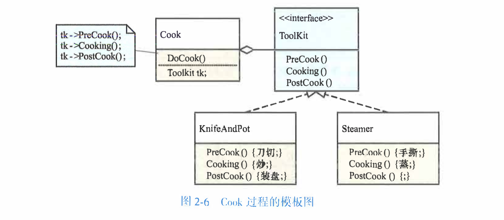

#### 观察者设计模式
观察者模式是一种类似于订阅的东西
流程
1. 个人读者或者报刊亭向报社发起订阅申请
2. 报社维护订阅列表
3. 新报印刷完毕，报社按照订阅发送报纸
4. 读者拿到报纸开始阅读，报刊拿到报纸开始售卖
   
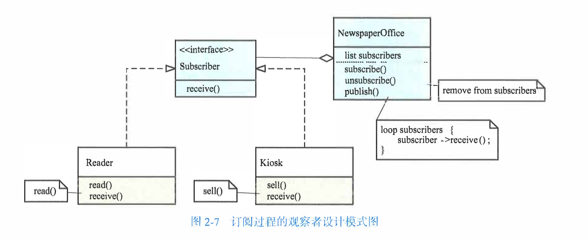

观察者模式在内核中 使用频率很高， 我们在内核中看到类似xxx_listene1名字的函数多半都是观察者，类似xxx_notify名字的函数多半都是被观察者

#### 举例(input子系统)

linux的input子系统里面有两个使用场景，一个是device设备驱动，一个是handler，前者是用于接受device的数据，这些数据量都不是很大，然后handler就是用于处理这些input事件，一个input事件由一个input_value结构体表里，里面有type，code，value，三个字段分别表示事件的类型，事件码和值
- input子系统有两个核心数据结构，一个是input_dev，一个是input_handler，一个是设备驱动，一是操作，二者是多对多关系，所以使用input_handle来当中间变量


## 三、linux内存管理

### DRAM 和 MMIO
我们一般说内存是指内部存储器(RAM)，但是从cpu的角度来说不是，cpu的角度来说是连接在总线上的所有存储(广义上的存储)
cpu访问的物理地址并不一定落在主存，cpu不知道和他连接的是什么存储设备，也不关心，只需要能读取数据和能正确写入就行

内存空间包含多种存储，ram是其中一个，还包括很多外部io的设备的空间，会将设备映射到内存空间(MMIO)，可以通过`cat /proc/iomem`查看系统的内存空间布局

设备的寄存器和它的内存(RAM)都可以成为mmio的一部分，在x86里面，cpu访问mmio和内存一样，以gpu为例，一般它的寄存器空间和它自身的内存都会以MMIO的形式供CPU访问，CPU可以像访问指针一样访问他的寄存器和数据

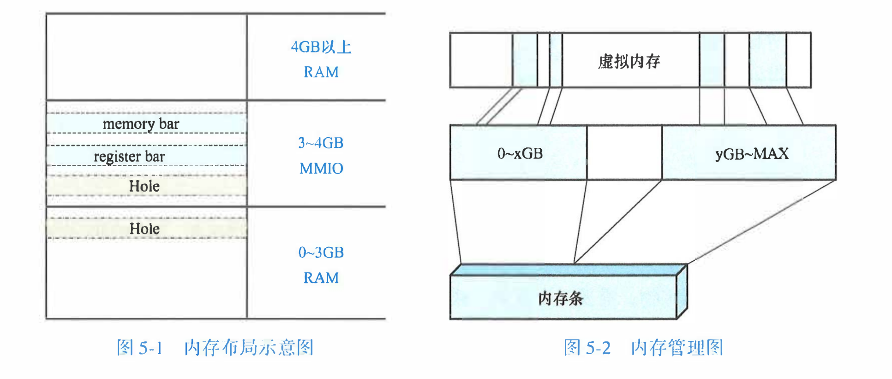
1. 图中的信息和/proc/iomem的中看到的信息并不是完全对立的，实际上/proc/iomem反应的是一段内存的的用途，通常来说是哪些内存是mmio的，然后在这里面看他们在内存中的位置，比如PCI Bar和IOAPIC
2. 整个内存是空间一般并不是连续的，会用不到的Hole

- 内存管理本质上是维护内存介质(RAM+MMIO)、内存空间和虚拟内存三者的关系

- prot IO
prot IO是和MMIO一样的功能，但是port IO不占用内存空间，它是一个独立的空间，大小为64KB，访问pio需要专门的指令，比如x86的in/out，一个外设可以同时有mmio和pio

### 内存分页
linux涉及三种地址：虚拟地址(Vitual Address)，线性地址(Linear Address)和物理地址(Physical Address)
- 关系
虚拟地址经过分段变成线性地址，分段就是类16似于cs:ip addr=cs<<16 + ip
在使用mmu(Memeory Management Unit, MMU)的系统中，线性地址经过转换生成物理地址(分页)
- 分段
  分段是虚拟地址到线性地址的映射，linux对分段的支持十分有限，linux主要的四个分段是用户代码段(_USER_CS)，用户数据段(_USER_DS)，内核代码段(_KERNEL_CS)，内核数据段(_KERNEL_DS)，他们的段描述基址都为0，所以转化后的虚拟地址和线性地址相等
- 分页
  分页机制完成了线性内存到物理内存、的映射。 分页，字面上理解就是将内存逻辑上分为一页页的, CPU要访间某个地址， 必须先找到该地址所在的页。如何找到该页呢，该页的地址存在上一级页的项中；上一级页的地址存在再上 一级页的项中，依次类推，最高一级的页的地址存在CPU的寄存器中，cr3里面

#### 寻址方式

线性地址的本质是偏移量
- 页表 (Page Table)：用于寻址的目录。它是一个多级索引结构，存储了虚拟地址到物理地址的映射线索，一个页表的大小通常是一个页框
- 页框 (Page Frame)：内存的物理容器。它是物理内存中被划分的固定大小（通常 4KB）的块，真正存放数据的地方

- 寻址过程 (多级索引 -> 定位)
1. 拆分地址：线性地址（虚拟地址）被切分成多段，前几段用于逐级查表，最后一段用于页内偏移。
2. 逐级查找：以第一级页表地址为起点，用地址的高位段作为偏移，依次在内存中找到下一级页表的物理位置，直到找到最终页框（Base_final）的基地址。

- 计算物理地址：最终物理地址 = 最终页框基地址 + 线性地址的低 12 位。因为页框大小是4KB(2
12)，所以低 12 位正好代表了在页框内部的精确偏移量

由于页表和页框都是 4KB 对齐的，它们在物理内存中的起始地址低 12 位永远是 0。因此，在页表项中存储下一级地址时，不需要精确到字节，这 12 位可以用来存放权限标志等额外信息，节省空间，一个页表项是4字节

eg 如果有一个0xc0012345的地址
页目录项的地址 = cr3 + 0x300 * 4，因为一个页表项是4字节大小，该项包含了PTable地址的高20位
PTable的地址加上0x12 * 4可得到对应的页表项的物理地址，该页表项包含了最终页框的高20位地址
物理地址 = 页框地址 + 0x345

1. 该过程由MMU硬件完成，和软件没有关系，但是分页和软件是由关系的
2. 各级页表的项所包含的地址是物理地址
3. 如果不同虚拟地址映射到一个页框，那么这个就是共享内存
4. 多级页表的目的是为了节省内存，没有用到的内存就可以不映射

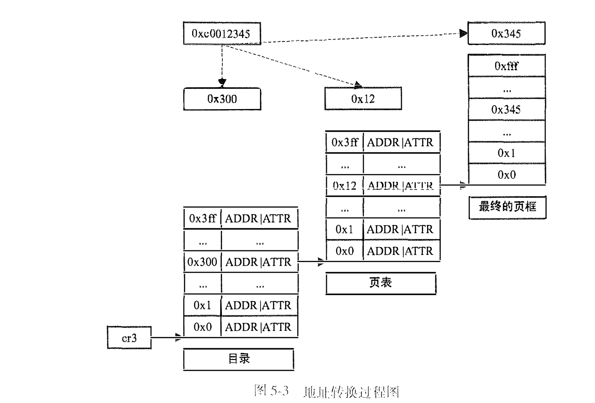

这种 32 = 10 + 10 + 12 的方式，虚拟地址最多只有4gb
x86将管脚变成36个，引入了PAE(物理地址拓展)
1. 页表项从4kb到8kb
2. 每级容纳的项从1024变成512
3. 页框大小支持4kb和2mb两种大小

- PAE 下的 3 级分页（标准模式）
适用场景：页框大小为 4KB。
地址划分：
32 位地址 = 2位（PDPT） + 9位（页目录） + 9位（页表） + 12位（页内偏移）
结构：
1. PDPT（Page Directory Pointer Table）：页目录指针表，由 CR3 寄存器指向。
2. 页目录（Page Directory）
3. 页表（Page Table）
4. 页内偏移（Offset）

- PAE 下的 2 级分页（大页模式）
适用场景：页框大小为 2MB。
地址划分：
32 位地址 = 2位（PDPT） + 9位（页目录） + 21位（页内偏移）
结构：
1. PDPT（Page Directory Pointer Table）
2. 页目录（Page Directory）
3. 页内偏移（Offset）
特点：无页表，页目录项直接指向 2MB 大页的物理起始地址。

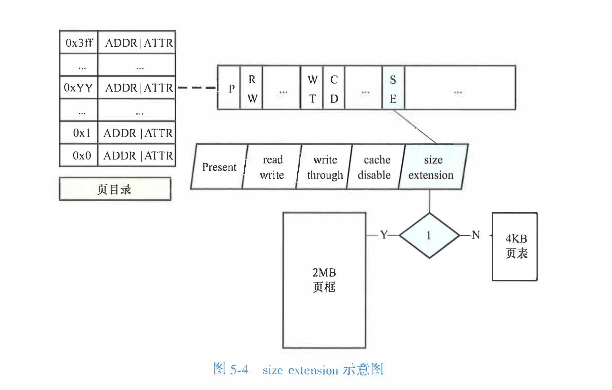

#### 内存映射

上面说到，mmu只负责寻址，那么设置页表项的addr和attr就是由内核来负责

linux为了兼容32位和64位的平台将线性地址分为5个级别
- 分别是
1. 页全局目录(Page Global Directory PGD)
2. 页四级目录(Page 4th Directory P4D)
3. 页上级目录(Page Upper Directory PUD)
4. 页中级目录(Page Middle Direcorty PMD)
5. 和页表(Page Table PT)

如果硬件不兼容，实际上就没有五级

这几个目录有优先级，分别是，页全局目录，页表，页中级目录，页上级目录，用不到的项数为0
eg 32位的常规分页是 10 0 0 0 10，对应PAE的4kb页框(2+9+9)就是 2 0 0 9 9

| 缩写 | 描述 |
| --- | --- |
| pgd、p4d、pud、pmd | PGD、P4D、PUD、PMDPGD、P4D、PUD、PMD 的项 |
| pte | page table entry，页表项 |
| pfn | page frame number，页框号按照 4KB 每个页框，从 0 到物理内存最大值依次编号 |
| pg、ofs | page、offset |
| PTRS | 项的数目 |


内核函数宏

| 函数和宏       | 描述                                                         |
| -------------- | ------------------------------------------------------------ |
| xxx_index      | xxx 可以是 pgd、p4d、pud、pmd、pte，表示线性地址在对应级别内的偏移量 |
| xxx_offset     | xxx 可以是 pgd、p4d、pud 和 pmd，用来获取该级别目标偏移量对应的项的指针 |
| pte_offset_kernel | 意义同上                                                 |
| set_xxx        | xxx 可以是 pgd、p4d、pud、pmd、pte 设置项                   |
| xxx_pfn        | xxx 可以是 pgd、p4d、pud、pmd、pte，获取项指向的页框号       |
| pfn_xxx        | xxx 可以是 pud、pmd、pte，根据 pfn 和属性生成项的值，利用__xxx 完成 |
| __xxx          | xxx 可以是 pgd、p4d、pud、pmd、pte，根据一个整数值生成项的值 |
| xxx_val        | xxx 可以是 pgd、p4d、pud、pmd、pte，根据项的值生成一个整数   |
| xxx_clear      | xxx 可以是 pgd、p4d、pud、pmd、pte，清除项的值               |  

利用以上的函数和宏，可以完成软件上的分页任务，比如一个4kb的页框，框号是0x12，那么他的物理地址是0x12000，常规分页情况下设置的代码是
```c
// pgd pud pmd and pte ard all pointers, pfn is 0x12
// pgd
pgd_idx = pgd_index((pfn << PAGE_SHIFT) + PAGE_OFFSET);
pgd = pgd_base + pgd_idx;

// p4d pud and pmd
p4d = p4d_offset(pgd, 0);
pud = pud_offset(p4d, 0);
pmd = pmd_offset(pud, 0);

// page table
pte_ofs = pte_index((pfn << PAGE_SHIFT) + PAGE_OFFSET);
if (!(pmd_val(* pmd) & _PAGE_PRESENT)) {
    pte_t * page_table = (pte_t *)alloc_low_page();
    set_pmd(pmd, _pmd(_pa(page_table) | _PAGE_TABLE));
}

pte = pte_offset_kernel(pmd, pte_ofs);
set_pte(pte, pfn_pte(pfn, port));
```

这段代码是简单介绍如何将虚拟地址和物理地址映射到一起的思路，所以共享内存的原理就是把两个不一样的虚拟地址映射到同一个物理地址，mmu是知道内核的分页模式的(通过寄存器的配置)

#### GPU Framebuffer

如果程序需要访问GPU的显存，GPU内部有一个DMA，可以通过厂商的封装去访问这个东西，或者使用MMIO


memorybar 将显存的一部分直接映射到内存空间中，我们可以直接映射需要访问的部分内存到虚拟空间，想访问普通内存一样直接访问


## 四、设备管理
### 计算机设备的连接和通信
#### 总线(bus)
设备一般通过bus和cpu通信，常见的总线有AMBA，PCIe等，设备和bus的工频率一般低于cpu
1. AMBA总线# 登录管理员账号后执行
sudo usermod -aG sudo tianjiao
    arm上的片上总线是级微控制器总线结构(AdvancedMicro-controller-Bus-Archiecture , MBA)规范，该规范定义了ARM架构片上系统(System-on-chip Soc)的通信标准，AMBA可以将arm处理器和其他ip盒进行集成，比如arm和fpga

    AMBA包括三组总线
    - 高级高性能总线（Advanced High-Performance Bus, AHB）：用于连接其他高性能 IP 核、片上和片外内存以及中断控制器等高性能模块
    - 高级系统总线（Advanced System Bus, ASB）：用于某些不必使用 AHB 但同时又需要高性能特性的芯片中，能起到一部分降低功耗的作用
    - 高级设备总线（Advanced Peripheral Bus, APB）：用于连接低速的设备，作为低功耗的精简接口总线
2. PCI总线
   组件互连（Peripheral Component Interconnect， PCI）标准，通过pci插槽连接，每个pci设备有一个唯一识别编号，包括总线号(bus number)，设备号(device number)，功能号(function number)

   当数据传输速率过高时，PCI 所采用的并行线路间会相互干扰。PCIe（PCI Express） 使用了基于数据包的串行连接协议，其相比于 PCI 总线来说带宽更高，同时保持了 PCI 设备驱动的前向兼容性

#### 可编程io
cpu通常以读写寄存器的方式和设备进行通信，一个设备有多个寄存器，可以在内存地址或者io地址间访问
- 设备寄存器有三个类型
    1. 控制寄存器: 接受驱动程序的命令
    2. 状态寄存器: 反馈设备的工作状态
    3. 输入/输出寄存器: 用于驱动和设备之间的数据交互
- 设备访问寄存器有两种方式
    1. 内存映射 MMIO(Memory-Mapped I/O)，将设备直接映射到内存空间，有独立的内存地址，读写内存指令即可控制设备 (todo1 本质)
    2. 端口映射 PMIO(Port-Mapped I/O)，通过端口操作指令和设备交互
    - 这两个统称 (PIO Programm I/O)

#### DMA
直接访问内存(Direct Memory Access, DMA)是一种在设备和内存之间高效传输的方式，和PIO不同，PIO需要cpu参与主动搬运数据，但是DMA允许设备绕过cpu直接读写内存

DMA的发起者可以是cpu也可以是设备，设备发起dma的过程
  1. 设备驱动在内存中申请一段DMA缓冲区
  2. 发起DMA请求
  3. 设备通过dma将数据拷贝到DMA缓冲区
  4. 拷贝完成设备触发中断通知cpu对缓冲区的数据进行处理

##### DMA控制器
在某些架构中，DMA的发起还需要DMA控制器的参与，DMA控制器和cpu和内存在同一系统总线上，有DMA控制器发起DMA的过程
  1. cpu向控制器发送DMA缓冲区的位置和长度，以及数据传输的方向，之后放弃总线的控制权
  2. 控制器获得总线权限，然后将设备的数据拷贝到内存
  3. 完成后控制器向cpu发送中断，cpu重新获得总线控制权
  - 如果是设备发起DMA那就是先通知控制器

  

有些架构可以让设备直接获得总线的控制权然后进行操作
    
##### iommu (todo 2)
大多数情况下，cpu上执行的操作系统代码在进行内存访问时使用的是虚拟地址(virtualaddress)，并通过 MMU 翻译成物理地址(physical address）)，设备进行 DMA 时访问的内存地址是总线地址(bus address)，其不同于虚拟地址和物理地址，当操作系统向 DMA 控制器注册 DMA 内存缓冲区时，需要填写的是总线地址，设备和内存之间的iommu(Input-Output Memory Management Unit，IOMMU)会负责将总线地址翻译成物理地址

在一些场景下设备使用的总线地址和物理地址相同。由于 DMA 在进行过程中会向连续的地址写入数据，因此操作系统需要分配连续的物理内存作为 DMA 缓冲区。IOMMU 的存在免除了 DMA 缓冲区各内存页必须物理连续的限制，同时 IOMMU 还限定了设备可以访问到的物理内存范围

- IOMMU 的另一个重要用途是为操作系统提供内存访问保护机制，用于防止恶意设备以及驱动对物理内存的非法访问。此外，IOMMU 还可用于在虚拟化环境中防止恶意虚拟机通过设备对其他虚拟机和虚拟机监控器内存进行非法访问


### 设备的识别

#### 设备树
#### ACPI

## 五、虚拟化 kvm
虚拟化si是一种资源管理技术，在主机上创建虚拟机， 用户可以在其数据服务器、计算机或主机上创建多个虚拟机

客户机(guest os，就是俗称的虚拟机)，是运行在主机(host os)上的，一个主机可以运行多个虚拟机，这个就需要一个虚拟机管理程序，叫做hypervisor又叫vmm(Virtual Machine Monitor)或者virtualer

### hypervisor
hypervisor又分两类
1. hypervisor直接运行在裸机上(Native or Bare-Metal)，它直接运行在实际的硬件上，管理guest os
2. hypervisor运行在操作系统上，和其他程序没有区别。hypervisor是作为host os上的一个进程存在的，guest os是在host os的基础上抽象来的


### kvm基本原理
编译出来的程序在虚拟机上运行的情况分两种
1. guest os和host os架构不同，这个时候需要做指令翻译
2. guest os和host os架构相同，这个时候可以选择指令翻译也可以选择硬件加速，kvm就是硬件加速的方案之一
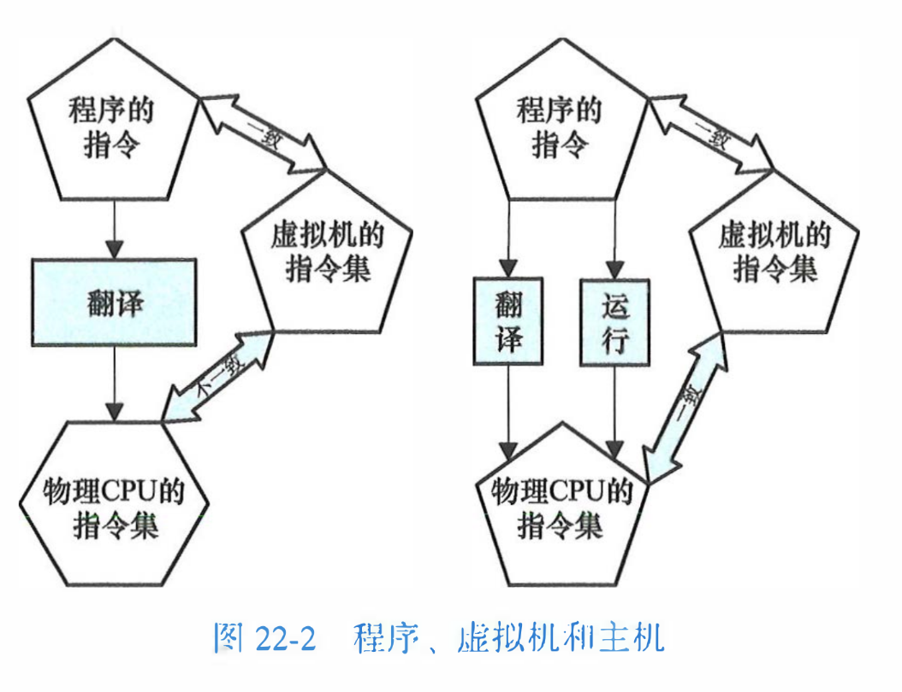

kvm(Kernel-Based Virtual Machine)，在linux中是内核的一部分，可以实现cpu和内存虚拟化，但是kvm不是一个纯软件的方案，需要硬件支持，比如intel-V 和 AMD-V

硬件方案实现的cpu虚拟化(vcpu)，但是没有实现io和设备虚拟化，相关io和设备的指令会推出kvm然后转到其他程序执行，比如qemu，然后回到kvm继续执行

加载完kvm.ko会创建 /dev/kvm文件，用户空间是用ioctl的方式和kvm交互

- 简单交互逻辑

```c
#include <fcntl.h>
#include <unistd.h>
#include <sys/ioctl.h>
#include <sys/mman.h>
#include <linux/kvm.h>

#define MAX_BIN_SIZE 0x1000

int kvm_fd, vm_fd, vcpu_fd, bin_fd;
int ret;
struct kvm_sregs sregs;
struct kvm_regs regs;
struct kvm_userspace_memory_region mem;
struct kvm_run *kvm_run;
void *userspace_addr;
long mmap_size;

kvm_fd = open("/dev/kvm", O_RDWR);
vm_fd = ioctl(kvm_fd, KVM_CREATE_VM, 0);
vcpu_fd = ioctl(vm_fd, KVM_CREATE_VCPU, 0);
bin_fd = open("my_binary.bin", O_RDONLY);

userspace_addr = mmap(NULL, MAX_BIN_SIZE, PROT_READ | PROT_WRITE, MAP_SHARED | MAP_ANONYMOUS, -1, 0);
read(bin_fd, userspace_addr, MAX_BIN_SIZE);

mem.slot = 0;
mem.flags = 0;
mem.guest_phys_addr = 0;
mem.memory_size = MAX_BIN_SIZE;
mem.userspace_addr = (unsigned long)userspace_addr;
ioctl(vm_fd, KVM_SET_USER_MEMORY_REGION, &mem);

mmap_size = ioctl(kvm_fd, KVM_GET_VCPU_MMAP_SIZE, NULL);
kvm_run = mmap(NULL, mmap_size, PROT_READ | PROT_WRITE, MAP_SHARED, vcpu_fd, 0);

ioctl(vcpu_fd, KVM_GET_SREGS, &sregs);
sregs.cs.base = 0;
sregs.cs.selector = 0;
ioctl(vcpu_fd, KVM_SET_SREGS, &sregs);

memset(&regs, 0, sizeof(struct kvm_regs));
regs.rip = 0;
ioctl(vcpu_fd, KVM_SET_REGS, &regs);

while (1) {
    ioctl(vcpu_fd, KVM_RUN, NULL);
    
    switch(kvm_run->exit_reason) {
        case KVM_EXIT_HLT:
            goto exit;
        case KVM_EXIT_EXCEPTION:
            break;
        default:
            break;
    }
}

exit:
close(kvm_fd);
close(bin_fd);
return 0;

```
前五步准备工作，包括创建vcpu，建立内存映射等，第六步bin运行在vcpu上，特殊的指令导致kvm推出后，KVM_RUN返回，然后处理这个终止，后面让vcpu继续执行
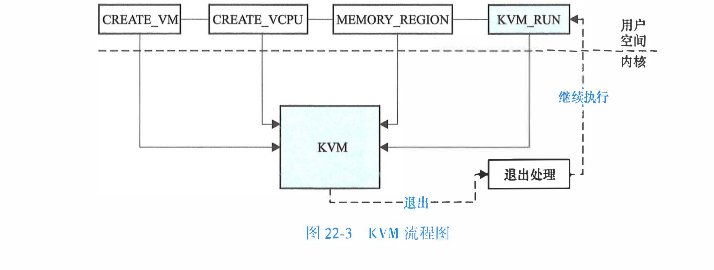

### kvm的具体实现
KVM_RUN会触发目标代码执行在vcpu上，在AMD-V的SVM(Secure Virtual Machine)模式中，最终会执行VMRUN指令，使cpu进入一个特殊的模式 guest mode

### intersept
在这个模式下，cpu正常执行指令，只不过会拦截需要处理的异常和我们希望被拦截的指令，比如io，当拦截后，cpu会保存执行状态到内存中(VMCB, virtual machine control block)
intercept列表也存 在VMCB内，发生Intercept后， exit code也存储在VMCB中

硬件上的exit code和实例程序中的宏不一样，是通过一个svm_invoke_exit_handler函数来转换的，这个是amd架构的执行方式

### cpu虚拟化
1. 用户空间配置执行环境
2. 通过KVM_RUN ioctl启动cpu虚拟化
3. cpu进入guest模式，执行我配置的指令
4. 如果cpu执行了intercept的列表中的指令，或者外部环境导致interctpt发生，cpu保存状态，推出guest mode，记录exit code
5. kvm接手处理exit code 将 exit code变成exit_reson
6. 返回用户空间，查看exit_reson并做进一步处理
7. 循环2 - 6这几个步骤
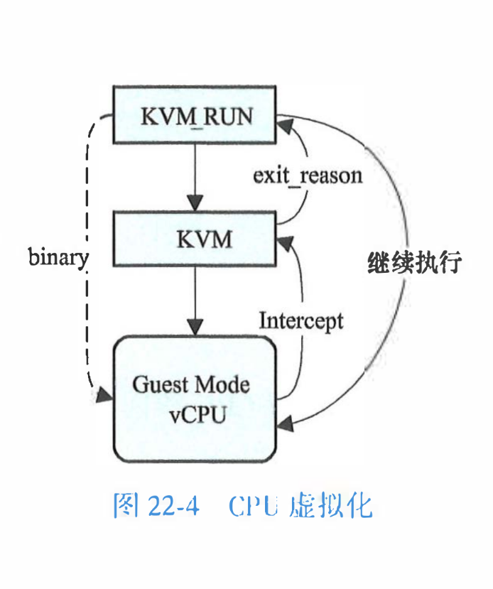

### kvm和qemu
qemu并不依赖kvm实现虚拟化，在没有kvm支持的情况下，qemu有一个TCG(Tiny Code Generator)做指令翻译，将需要运行的指令翻译成当前cpu可执行的指令

在有kvm的支持下，可以不需要tcg，kvm负责cpu和内存的虚拟化，然后qmeu负责io，设备的虚拟化


### 设备虚拟化
设备虚拟化，分为两类
1. 纯虚拟化，对于guet os来说，这类设备和物理设备没有区别
2. 半虚拟化，设备会根据约定告诉guest os自己是虚拟的，二者通过约定的方式通信，可以根据guestos进行性能优化，但是缺点是需要改动guest os，定制驱动
   
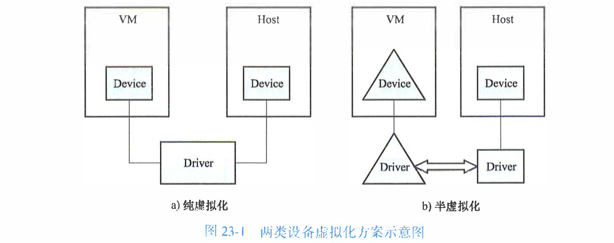

#### virtio
virio是一种半虚拟化的方案
关于设备是如何告诉guest os是一个虚拟virtio设备的，其实是在设备端和驱动中实现的
- eg 如果是virtioPCI设备，设备端添加vendor id = PCI_VENDOR_lD_REDHAT_QUMRANET的设备，驱动端可以直接匹配

双方是通过共享内存进行交互的，这个共享内存是用ring buffer进行管理

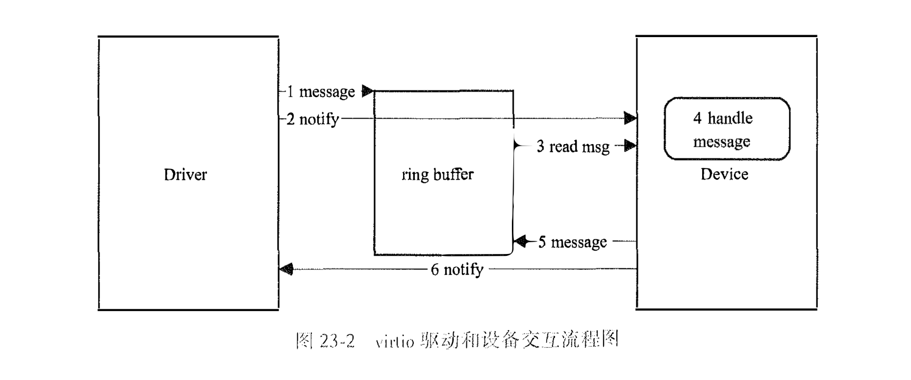

1. 驱动将descriptor和它们的信息写入ring buffer
2. 驱动提醒设备端ring buffer更新了，
3. 设备从ring buffer读取信息
4. 解析信息，处理驱动请求，比如将数据复制到指定的地址
5. 设备将结果写回ring buffer
6. 设备端通过中断通知驱动更新完毕，驱动处理中断

驱动写入，设备读取；设备写入，驱动读取

#### vfio
##### 基础概念
- vfio是虚拟化硬件加速方案中的其中一个方案
- vfio是一个设备直通(pass-through)技术，用户态可以直接用过使用vfio驱动直接访问硬件，这个过程是基于IOMMU保护的，iommu可以把设备io，中断，dma等能力呈现给用户态

##### 原理
vfio使用DMA remapping和Interrupt remapping，DMA remapping使用iommu限制设备的io访问，Interrupt remapping使用中断重映射做中断隔离

##### iommu
iommu是一种内存管理单元（MMU），它将具有直接存储器访问能力（可以DMA）的I/O总线连接至主内存，iommu将设备可见的虚拟地址（在此上下文中也称设备地址或I/O地址）映射到物理地址。部分单元还提供内存保护功能，防止故障或恶意的设备
iommu使用iommu guest os可以直接访问gpa(guest physical address)就不访问hpa(host physical address)，iommu维护gpa或者iova到hpa的映射

##### group
iommu和vfio都有group的概念，两者几乎是一样的
iommu对dma的隔离的单位是group，group可以只有一个或多个devices，如果一个设备可以绕过iommmu和其他设备通信，比如p2p(peer to peer)，就不能独立成一个group

##### container
多个group可以绑定到一个vfio container，共享iommu的上下文，比如iova到hva的映射


- vfio使用样例
```c
int container, group, device;
struct vfio_group_status group_status = { .argsz = sizeof(group_status) };
struct vfio_iommu_type1_info iommu_info = { .argsz = sizeof(iommu_info) };
struct vfio_iommu_type1_dma_map dma_map = { .argsz = sizeof(dma_map) };
struct vfio_device_info device_info = { .argsz = sizeof(device_info) };

container = open("/dev/vfio/vfio", O_RDWR);
group = open("/dev/vfio/18", O_RDWR);
ioctl(group, VFIO_GROUP_SET_CONTAINER, &container);
ioctl(container, VFIO_SET_IOMMU, VFIO_TYPE1_IOMMU);
ioctl(container, VFIO_IOMMU_GET_INFO, &iommu_info);

// 将group加入到container中
ioctl(group, VFIO_GROUP_SET_CONTAINER, &container);
ioctl(container, VFIO_SET_IOMMU, VFIO_TYPE1_IOMMU);
ioctl(container, VFIO_IOMMU_GET_INFO, &iommu_info);

// 建立iova到hpa的映射
dma_map.vaddr = mmap(0, 1024 * 1024, PROT_READ | PROT_WRITE,
                     MAP_PRIVATE | MAP_ANONYMOUS, 0, 0);
dma_map.size = 1024 * 1024;
dma_map.iova = 0;
dma_map.flags = VFIO_DMA_MAP_FLAG_READ | VFIO_DMA_MAP_FLAG_WRITE;
ioctl(container, VFIO_IOMMU_MAP_DMA, &dma_map);
```

##### vfio驱动
上面样例代码中的container group device分别对应vfio里面的 vfio_container vfio_group vfio_device

- 调用栈
```
ioctl()系统调用
vfio_fops_unl_ioctl
vfio_iommu_type1_ioctl
vfio_iommu_type1_map_dma
vfio_pin_map_dma
vfio_iommu_map
iommu_map
```

(todo 3)
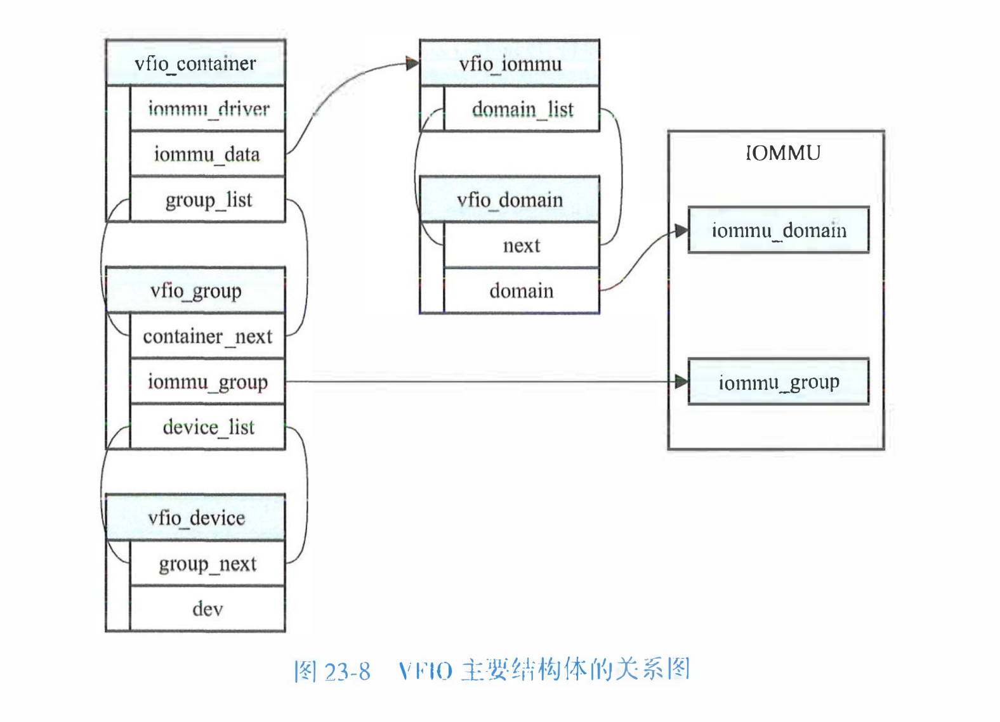
