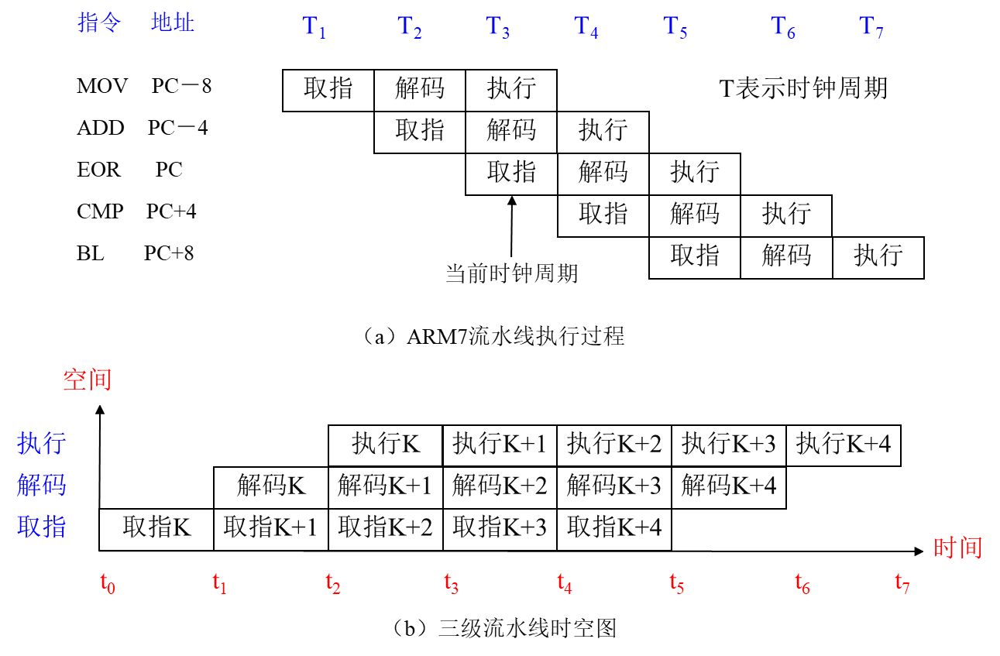

## 嵌入式系统设计


### 一、概述

### 二、ARM Cortex-M3内核

#### 1. arm分类

#### 2. arm内核

   - 32位的ARM指令集。

     >对应处理器状态：ARM状态、

   - 16位的Thumb指令集。

     >  对应处理器状态：Thumb状态

   > [!NOTE]
   >
   > 这两种指令集也对应了两种处理器执行状态<br>
   >
   > 在程序的执行过程中, 处理器可以动态地在两种执行状态之中切换。<br>
   >
   > 实际上，Thumb指令集在功能上是ARM指令集的一个子集，但它能带来更高的代码密度，给目标代码减肥。

#### 3. 工作模式

#####  (1) 指令集

- CICS: 复杂指令集 (Complex Instruction Set Computer)

  >1. 具有大量的指令和寻址方式
  >2. 8/2原则：80%的程序只使用20%的指令
  >3. 大多数程序只使用少量的指令就能够运行。

- RISC: 精简指令集 (Reduced Instruction Set Computer)

  > 1.  在通道中只包含最有用的指令
  > 2.  确保数据通道快速执行每一条指令
  > 3.  使CPU硬件结构设计变得更为简单

#####  (2) 流水线

> [!TIP]
>
> CPU中的流水线技术是一种将指令分解为多步，并让不同指令的各步操作重叠执行，从而实现几条指令并行处理，以加速程序运行过程的技术。
>
> ARM7采用三级流水线、ARM9采用五级流水线，ARM10采用六级流水线、ARM11采用八级流水线。


- **ARM7三级流水线工作**

  >1. 取指，从存储器中装载一条指令到CPU中
  >2. 解码，识别并解释将要被执行的指令
  >3. 执行，将解码识别的指令进行计算处理并将结果写回寄存器



##### (3) 处理器结构

- 哈佛结构

  > 哈佛结构是一种将程序中**指令和数据分开存储**的存储器结构。<br>
  >
  > 它是一种并行存储体系结构，程序存储器和数据存储器采用不同的总线，从而提供较大的存储器带宽


- 冯·诺伊曼结构
  
  >冯·诺伊曼结构也称普林斯顿结构，是一种将**程序指令存储器和数据存储器合并在一起的**存储器结构。<br>
  >
  >程序指令存储地址和数据存储地址指向同一个存储器的不同物理位置。
  
> [!TIP]
>
> ARM7采用了普林斯顿结构，随后的ARM9、ARM10、ARM11、ARM Cortex等处理器采用了哈佛结构。 


##### (3) 总线规范

- AMBA (Advanced Microcontroller Bus Architecture) 总线规范是ARM公司设计的一种用于高性能嵌入式系统的总线标准

  >AMBA 2.0规范中定义了三种可以组合使用的不同类型的总线：
  >
  >AHB(Advanced High-performance Bus)、ASB(Advanced System Bus)\APB(Advanced Perpheral Bus)
  >
  >1. AHB总线适用于连接高性能和高时钟频率的系统模块 
  >2. ASB总线适用于连接高性能的系统模块。它的读/写数据总线采用的是同一条双向数据总线
  >3. APB总线适用于连接低功耗的外部设备模块


#### 4. Cortex M3内核

#####  (1) Cortex M3内核整体结构框架

1. 处理器核 (Processor Core System) —包括CPU和NVIC
2. 内存保护单元 (Memory Protection Unit--MPU)
3. 内部总线接口 (Bus Interconnect)
4. 为了方便调试和跟踪的可选的Debug System和Debug Intertface单元组成

##### (2) Cortex-M3内部结构

1. ALU
2. 寄存器组
3. 内建的嵌套向量中断控制器
4. CM3 采用了哈佛结构，拥有独立的指令总线和数据总线，可以让取指与数据访问并行进行
5. 比较复杂的应用可能需要更多的存储系统功能，为此CM3 提供一个可选的MPU，而且在需要的情况下也可以使用外部的cache。另外在CM3 中，小端模式和大端模式都是支持的。
6. CM3 内部还附赠了好多调试组件，用于在硬件水平上支持调试操作，如指令断点，数据观察点等。另外，为支持更高级的调试，还有其它可选组件，包括指令跟踪和多种类型的调试接口

##### (3) MPU概览

> 在Cortex‐M3处理器中可以**选配**一个存储器保护单元（MPU），它可以实施对存储器（主要是内存和外设寄存器）的保护，以使软件更加健壮和可靠。在使用前，必须根据需要对其编程。如果没有启用MPU，则等同于系统中没有配MPU。MPU有如下能力可以提高系统的可靠性：

1. 阻止用户应用程序破坏操作系统使用的数
2. 阻止一个任务访问其它任务的数据区，从而把任务隔开
3. 可以把关键数据区设置为只读，从根本上消除了被破坏的可能。检测意外的存储访问，如，堆栈溢出，数组越界

##### (4) Cortex-M3 的工作状态

> Cortex-M3 处理器有以下两种工作状态

1.  **Thumb状态** 这是16位和32位半字对齐的Thumb和Thumb-2指令的正常执行状态
2. **调试状态** 处理器停机调试的时候进入该状态 

> [!NOTE]
>
> 与ARM7处理器不同，Cortex-M3处理器不支持ARM指令的执行，也就没有ARM状态

##### (5) Cortex-M3的工作模式

> [!IMPORTANT]
>
> Cortex-M3 处理器支持两种工作模式 线程模式 (thread mode) 和 处理模式 (handler mode)

>在复位时，Cortex-M3 处理器进入线程模式，异常返回时也会进入该模式，特权和用户 (非特权) 代码能够在线程模式下运行。<br>
>
>出现异常时，Cortex-M3 处理器进入处理模式，在处理模式中，所有代码都是特权访问的

##### (6) Cortex-M3 代码的特权分级

> Cortex-M3的代码执行进行了特权分级，可以分为特权执行和非特权执行。特权执行时可以访问所有资源。非特权执行时对有些资源的访问受到限制或不允许访问
>
> 特权分级可以提供一种存储器访问保护机制，避免普通用户因程序代码出现意外而对存储器关键区域进行操作，这也是一种基本的安全模型
>
> 处理模式始终是特权访问，线程模式可以是特权访问，也可以是非特权访问

##### (7) 操作模式和特权级别

- **工作模式** 

  >实际上就是指Cortex-M3核当前的运行模式，有**线程模式**和**处理器模式**两种。若Cortex-M3核正在运行的是用户的应用程序，那么当前的操作模式就是线程模式；若Cortex-M3核正在运行的是异常（中断）服务程序，那么当前的操作模式就是处理器模式。

- **特权级别** 

  >指在当前操作模式下，程序代码对系统硬件资源访问和使用的优先级别，包括用户级和特权级两种。特权级能够使用所有的指令访问所有的资源。用户级不能执行特权级指令（如MSR/MRS），有限制的访问存储器和外围模块。引入用户级和特权级两级特权级别的目的，是为了提供一种存储器访问的保护机制，使得普通的用户程序代码不能意外地，甚至是恶意地执行涉及到要害的操作

##### (8) Cortex-M3的双堆栈机制

> Cortex-M3的程序存储使用堆栈来实现。整个系统提供一个主堆栈MSP(Main Stack Pointer)供用户程序和异常处理程序使用，每一个处于线程模式的程序也有一个自己的进程堆栈PSP(Process Stack Pointer)


##### (9) 寄存器阵列

- Cortex-M3 分类

~~~
├── 通用寄存器 (R0-R15)
│   ├── 低组寄存器 (R0-R7)
│   ├── 高组寄存器 (R8-R12)
│   ├── 堆栈指针寄存器 SP (R13)
│   ├── 链接寄存器 LR (R14)
│   └── 程序计数器 PC (R15)
│
└── 特殊功能寄存器
    ├── 程序状态寄存器 (xPSR) [三合一]
    │   ├── APSR
    │   ├── IPSR
    │   └── EPSR
    │
    ├── 中断屏蔽寄存器组
    │   ├── PRIMASK
    │   ├── FAULTMASK
    │   └── BASEPRI
    │
    └── 控制寄存器 (CONTROL)
~~~

> [!NOTE]
>
> - 通用目的寄存器R0-R7：R0‐R7 也被称为低组寄存器。所有指令都能访问它们。（绝大多数16 位指令只能使用R0‐R7） ，复位后的初值不确定；
>
> - 通用目的寄存器R8-R12：R8‐R12 也被称为高组寄存器。只有很少的16 位Thumb 指令能访问它们，32位的Thumb2指令则不受限制，复位后的初值不确定
>
> - 堆栈指针R13：R13 是堆栈指针。在CM3 处理器内核中共有两个堆栈指针，于是也就支持两个堆栈。
>
>   1. **主堆栈指针（MSP），**或写作SP_main。这是缺省的堆栈指针，它由OS 内核、异常服务例程以及所有需要特权访问的应用程序代码来使用
>
>   2. **进程堆栈指针（PSP）**，或写作SP_process。用于常规的应用程序代码
>
>      > [!NOTE]
>      >
>      > 并不是每个应用都必须用齐两个堆栈指针。简单的应用程序只使用MSP就够了。

- ARM Cortex-M3寄存器组


- 主堆栈和进程堆栈, R13，两个堆栈指针

  >[!IMPORTANT]
  >
  >1. Cortex-M3内核有两个堆栈指针：MSP和PSP
  >
  >2. 结束复位后，所有代码都使用主堆栈 
  >
  >3. 所有异常都使用主堆栈
  >
  >4. 异常处理程序（例如SVC）可以通过改变其在退出时使用的EXC_RETURN值来改变线程模式使用的堆栈。
  >
  >5. 在线程模式中，使用MSR指令对CONTROL[1]执行写操作也可以从主堆栈切换到进程堆栈
  >
  >6. 堆栈指针R13是分组寄存器，在SP_main和SP_process之间切换。任何时候，进程堆栈和主堆栈中只有一个是可见的，由R13指示

  > 通过MSR指令修改CONTROL[1]进行堆栈切换
  >
  > 

- 堆栈寄存器

  > [!IMPORTANT]
  >
  > - 在Cortex‐M3 中，有专门的指令负责堆栈操作——PUSH 和POP。它俩的汇编语言语法如下例所演示：
  >
  >   ~~~assembly
  >   PUSH {R0}
  >   POP {R0}
  >   ~~~
  >
  > - 在程序中为了突出重点，可以使用SP 表示R13。在程序代码中，MSP 和PSP 都被称为R13/SP。不过，我们可以通过MRS/MSR 指令来指名道姓地访问具体的堆栈指针。
  >
  > - MSP，亦写作SP_main，这是复位后缺省使用堆栈指针，服务于操作系统内核和异常服务例程；而PSP，亦写作SP_process，典型地用于普通的用户线程中。
  >
  > - 通常在进入一个子程序后，第一件事就是把寄存器的值先PUSH 入堆栈中，在子程序退出前再POP 曾经PUSH 的那些寄存器。另外，PUSH 和POP 还能一次操作多个寄存器，如下所示：
  >
  >   ~~~assembly
  >   subroutine1
  >   	push {R0-R7, R12, R14}
  >   	...							;执行处理
  >   	pop {R0-R7, R12, R14}		;恢复寄存器列表
  >   	BX 14                       ;返回主函数
  >   ~~~
  >
  >   
  >
  > - 堆栈指针用于访问堆栈，并且PUSH指令和POP指令默认使用SP
  >
  >   >~~~assembly
  >   >;eg.
  >   >PUSH {R0}  		; *(--R13)=R0,R13是long*的指针（32位字长）
  >   >
  >   >POP  {R0} 		;R0=*R13++
  >   >
  >   >PUSH {R0}   	; *(--R13)=R0
  >   >
  >   >POP  {R0}		;R0=*R13++
  >   >
  >   >~~~
  
- Cortex-M3堆栈的实现与应用

  > 　 Cortex-M3使用的是“向下生长的满栈”模型。向下生长意味着堆栈规模向较低的地址空间扩大，栈顶SP的值在减小。满栈则是指堆栈指针 SP指向最后一个被压入堆栈的32位数值。在下一次压栈时，SP先自减 4，再存入新的数值。
  >
  >
  >
  >- 堆栈指针的最低两位永远是0， 这意味着堆栈总是4字节对齐的-也就是说他们的地址必须是0x4,0x8,0xc,……。 事实上， R13的最低两位被硬线连接到 0，并且总是读出0

- 连接寄存器（LR）

  >[!NOTE]
  >
  >1. R14 是连接寄存器（LR）：用于在程序转移前保存当前的地址（系统自动完成），以便程序的返回（用户程序完成）。
  >2. 在一个汇编程序中，你可以把它写作 LR 或R14。LR 用于在调用子程序时存储返回地址。例如，当你在使用BL(分支并连接，Branch and Link)指令时，就自动填充LR 的值
  >
  >~~~assembly
  >main
  >	BL function1   		;使用分支连接 呼叫function1
  >						;PC = function1 并且 LR = main 的吓下一条指令
  >						
  >function1
  >	...
  >	BX LR				;函数返回，如果function要使用LR，必须在使用前PUSH
  >						;不然返回程序就跑飞了
  >~~~
  >
  >3. 与大多数其他处理器不同的是， ARM 为了减少访问内存的次数（访问内存的操作往往需要 3 个以上指令周期）， 把返回地址直接存储在寄存器中。 这样足以使很多只有 1 级子程序调用的代码， 在返回时无需访问堆栈内存， 从而提高了子程序调用的效率。 如果多于 1 级， 则需要把前一级的R14 值压入堆栈。 在 ARM 上编程时， 应尽量只使用寄存器保存中间结果， 迫不得已时才访问内存。

- 程序计数器  (R15)

  >- R15 是程序计数器，在汇编代码中你也可以使用名字“PC”来访问它。因为CM3 内部使用了指令流水线，读PC 时返回的值是当前指令的地址+4（+8？）。比如说：
  >
  >  >[!TIP]
  >  >
  >  >**可以通过直接给把R14（LR）寄存器的值送R15（PC），实现程序的返回**
  >
  > ~~~~assembly
  > 0x1000: MOV R0, PC ; R0 = 0x1004
  > ~~~~
>

- 特殊功能寄存器

  >Cortex‐M3 还在内核水平上搭载了若干特殊功能寄存器，包括:
  >
  >1. **程序状态字寄存器组**（PSRs或xPSR）
  >2. **中断屏蔽寄存器组**（PRIMASK, FAULTMASK, BASEPRI）
  >3. **控制寄存器**（CONTROL）
  >
  >它们只能被专用的MSR 和MRS 指令访问：
  >
  >~~~assembly
  >MRS <gp_reg>, <special_reg> 	;读特殊功能寄存器的值到通用寄存器
  >MSR <special_reg>, <gp_reg>	 ;写通用寄存器的值到特殊功能寄存器
  >~~~
  >
  >| 寄存器    | 功能                                                         |
  >| --------- | ------------------------------------------------------------ |
  >| xPSR      | 记录ALU标志（0标志，进位标志，负数标志，溢出标志），执行状态，以及当前正服务的中断号。 |
  >| PRIMASK   | 除能所有的中断——当然了，不可屏蔽中断（NMI）才不甩它呢。      |
  >| FAULTMASK | 除能所有的fault——NMI依然不受影响，而且被除能的faults会“上访”，见后续章节的叙述。 |
  >| BASEPRI   | 除能所有优先级不高于某个具体数值的中断。                     |
  >| CONTROL   | 定义特权状态（见后续章节对特权的叙述），并且决定使用哪一个堆栈指针。 |
  >
  >- 程序状态寄存器
  >
  >>程序状态寄存器在其内部又被分为三个子状态寄存器
  >
  >>1. 应用程序 PSR（APSR）
  >>2. 中断号 PSR（IPSR）
  >>3. 执行 PSR（EPSR）
  >
  >>通过MRS/MSR 指令，这3 个PSRs 既可以单独访问，也可以组合访问（2 个组合，3 个组合都可以）。当使用三合一的方式访问时，应使用名字“xPSR”或者“PSRs”。
  >
  >>xPSR、IPSR、EPSR寄存器只能在特权模式下被访问， APSR可以在特权或非特权（用户级）访问。
  >
  >>
  >
  >>- xPSR标志位
  >
  >>| 标志位                                  | 含义                                                         |
  >>| --------------------------------------- | ------------------------------------------------------------ |
  >>| N-Negtive                               | 负数标志位。当算术运算或比较操作的结果为负数时，该位被置为 1；结果为非负数时，该位为 0。例如，在进行两个补码数的减法运算后，如果结果是负数，N 位就会被置 1。 |
  >>| Z-Zero                                  | 零标志位。当算术运算或比较操作的结果为 0 时，该位被置为 1；结果不为 0 时，该位为 0。比如，执行一个减法运算后，若差为 0，Z 位就会被置 1 |
  >>| C-Carry                                 | **四种方法设置**C的值：加法运算：当运算结果产生了进位时（无符号位溢出），C=1，否则C=0.减法运算：当运算时产生了借位时（无符号数溢出），C=0，否则C=1.对于包含移位操作的非加/减运算指令，C为移除值的最后一位。对于其他的非加/减运算指令，C的值通常不会改变 |
  >>| V-Overflow                              | 溢出标志位。在有符号整数的算术运算中，如果运算结果超出了有符号数所能表示的范围，该位被置为 1，否则为 0。例如，在进行两个有符号字节数相加，结果超出了 - 128 到 127 的范围时，V 位就会被置 1 |
  >>| Q-饱和标志，在实现DSP扩展的处理器中使用 | 在实现数字信号处理（DSP）扩展的处理器中使用，用于指示算术运算是否发生了饱和情况。当运算结果达到了可表示的最大值或最小值并不能再继续增大或减小（即发生饱和）时，Q 位被置 1。 |
  >>| ICI/IT                                  | \- **ICI**（Interrupt Controller Type）：与中断控制器相关，用于中断继续指令位。<br/>\- **IT**（Interrupt Type）：记录 IF-THEN 指令状态，用于条件执行，确保指令按预期逻辑执行。 |
  >>| T                                       | 当前运行的是 Thumb 指令集（恒为 1）。Thumb 是 ARM 指令集的压缩形式，代码密度高，适用于嵌入式系统。 |
  >>| Exception Number                        | \- **线程模式**：值为 0。<br/>\- **Handler 模式**：存放异常号（8 位，0~255），对应不同异常类型（如中断、复位、系统调用等），处理器据此调用相应异常处理程序。 |
  >
  >
  >- 中断屏蔽寄存器组
  >
  >>1. PRIMASK：（外部中断）关中断，中断屏蔽寄存器（相当于X86的IF）
  >>2. FAULTMASK：（内部中断）关异常，留给操作系统用。
  >>3. BASEPRI ：关闭优先级大于某值的中断（不响应优先级低的中断）
  >
  >>**只有在特权级下，才允许访问这3个寄存器。**
  >
  >>| 寄存器    | 功能描述                                                     |
  >>| --------- | ------------------------------------------------------------ |
  >>| PRIMASK   | 这是个只有1个位的寄存器。当它置1时，就关掉所有可屏蔽的异常，只剩下NMI和硬fault可以响应。它的缺省值是0，表示没有关中断。 |
  >>| FAULTMASK | 这是个只有1个位的寄存器。当它置1时，只有NMI才能响应，所有其它的异常，包括中断和fault，通通闭嘴。它的缺省值也是0，表示没有关异常。 |
  >>| BASEPRI   | 这个寄存器最多有9位（由表达优先级的位数决定）。它定义了被屏蔽优先级的阈值。当它被设成某个值后，所有优先级号大于等于此值的中断都被关（优先级号越大，优先级越低）。但若被设成0，则不关闭任何中断，0也是缺省值。 |
  >
  >>~~~assembly
  >>; CM3处理器快速中断控制指令集
  >>; 语法格式：CPS<effect> <iflags>
  >>; 1. 关闭所有可屏蔽中断（设置PRIMASK）
  >>CPSID I     ; PRIMASK = 1，关中断
  >>; 2. 开启所有可屏蔽中断（清除PRIMASK） 
  >>CPSIE I     ; PRIMASK = 0，开中断
  >>; 3. 关闭所有异常（包括fault，设置FAULTMASK）
  >>CPSID F     ; FAULTMASK = 1，关异常
  >>; 4. 开启所有异常（清除FAULTMASK）
  >>CPSIE F     ; FAULTMASK = 0，开异常
  >>
  >- CONTROL 寄存器
  >
  >> 用于控制和确定处理器的工作模式以及当前执行任务的特性
  >
  >> 以下是提取自图片的表格内容：
  >
  >> | 位         | 功能说明                                                     |
  >> | ---------- | ------------------------------------------------------------ |
  >> | CONTROL[1] | **堆栈指针选择**  • 0 = 主堆栈指针 MSP（复位缺省值）  • 1 = 进程堆栈指针 PSP    *使用规则：*  - 线程模式或基础级（非异常响应时）可使用PSP  - Handler模式下强制使用MSP（禁止写1） |
  >> | CONTROL[0] | **特权级别控制**  • 0 = 特权级线程模式  • 1 = 用户级线程模式    *补充说明：*  - Handler模式始终为特权级 |
  >
  >> 1. 当处理器处在**线程状态下**时，既可以使用特权级，也可以使用用户级；另一方面，**handler****模式**总是特权级的。在复位后，处理器进入线程模式＋特权级。
  >> 2. 在线程模式＋用户级下，对系统控制空间（SCS）的访问将被阻止——该空间包含了配置寄存器 以及调试组件的寄存器s。除此之外，还禁止使用MSR 访问特殊功能寄存器——除了APSR 有例外。谁若是以身试法，则将fault 伺候。
  >> 3. 在特权级下的代码可以通过置位CONTROL[0]来进入用户级。而不管是任何原因产生了任何异常，处理器都将以特权级来运行其服务例程，异常返回后将回到产生异常之前的特权级。用户级下的代码不能再试图修改CONTROL[0]来回到特权级。它必须通过一个异常handler，由那个异常handler来修改CONTROL[0]，才能在返回到线程模式后拿到特权级。
  >
  >

#####  (10) 异常和中断

- ARM Cortex-M3异常处理

> 1. 当正常的程序执行流程发生暂时停止时，称之为异常。
>
> 2. 例如，处理一个外部的中断请求，系统执行完当前执行的指令后可以转去执行异常处理程序。在处理异常之前，当前处理器的状态必须保留，这样当异常处理完成之后，当前程序可以继续执行。
>
> 3. 处理器允许多个异常同时发生，它们将会按固定的优先级进行处理。
> 4. Cortex-M3内核的异常响应系统，支持为数众多的系统异常和外部中断。
> 5. 其中，编号为1～15的对应系统异常，大于等于16的则全是外部中断。
> 6. 除了个别异常的优先级被定死外，其它异常的优先级都是可编程的。
> 7. 由于芯片设计者可以修改Cortex-M3的硬件描述源代码，所以做成芯片后支持的中断源数目常常不到240个，并且优先级的位数也由芯片厂商最终决定。

- NVIC管理的中断来自两个方面

  1.  **(内部中断)** 一个是来自Cortex M3处理器核内部的系统异常，系统异常是与处理器同步的事件，通常来自确定的内部错误，如指令执行了除0这样的非法操作，或者访问被禁的内存区间等
  2.  **(外部中断)** 另一类来自处理器外部的外设产生的中断。为了方便起见，后续将内部产生的系统异常中断称为内部中断，而由外部外设产生的中断称为外部中断

- 异常类型号表

  >Cortex‐M3 支持大量异常，包括16‐4‐1= 11 个系统异常，和最多240 个外部中断—简称IRQ，共256个中断（含异常）
  >
  >---与X86对中断的管理类似了！
  >
  >---通过向量表提供入口地址。
  >
  >| 编号 | 类型              | 优先级   | 简介                                                         |
  >| ---- | ----------------- | -------- | ------------------------------------------------------------ |
  >| 0    | N/A               | N/A      | 没有异常在运行                                               |
  >| 1    | 复位              | -3(最高) | 复位                                                         |
  >| 2    | NMI               | -2       | 不可屏蔽中断(来自外部 NMI 输入脚)                            |
  >| 3    | 硬(hard) fault    | -1       | 所有被除能的 fault，都将“上访”成硬 fault。除能的原因包括当前被禁用，或者 FAULTMASK 被置位。 |
  >| 4    | MemManage         | 可编程   | 存储器管理 fault，MPU 访问犯规以及访问非法位置均可引发。企图在“非执行区”取指也会引发此 fault |
  >| 5    | 总线 fault        | 可编程   | 从总线系统收到了错误响应，原因可以是预取流产(Abort)或数据流产，或者企图访问协处理器 |
  >| 6    | 用法(usage) fault | 可编程   | 由于程序错误导致的异常。通常是使用了一条无效指令，或者是非法的状态转换，例如尝试切换到 ARM 状态 |
  >| 7-10 | 保留              | N/A      | N/A                                                          |
  >| 11   | SVCall            | 可编程   | 执行系统服务调用指令(SVC)引发的异常                          |
  >| 12   | 调试监视器        | 可编程   | 调试监视器(断点，数据观察点，或者是外部调试请求)             |
  >| 13   | 保留              | N/A      | N/A                                                          |
  >| 14   | PendSV            | 可编程   | 为系统设备而设的“可悬挂请求”(pendable request)               |
  >| 15   | SysTick           | 可编程   | 系统滴答定时器(周期性溢出的时基定时器)                       |
  >| 16   | IRQ #0            | 可编程   | 外中断#0                                                     |
  >| 17   | IRQ #1            | 可编程   | 外中断#1                                                     |
  >| ...  | ...               | ...      | ...                                                          |
  >| 255  | IRQ #239          | 可编程   | 外中断#239                                                   |
  >
  >**分类标注**：
  >- 内部异常（编号0-15）
  >- 外部中断（编号16-255）

- 异常向量

  >| 异常类型 | 表项地址偏移量 | 异常向量        |
  >| -------- | -------------- | --------------- |
  >| 0        | 0x00           | MSP的初始值     |
  >| 1        | 0x04           | 复位            |
  >| 2        | 0x08           | NMI             |
  >| 3        | 0x0C           | 硬fault         |
  >| 4        | 0x10           | MemManage fault |
  >| 5        | 0x14           | 总线fault       |
  >| 6        | 0x18           | 用法fault       |
  >| 7-10     | 0x1C-0x28      | 保留            |
  >| 11       | 0x2C           | SVC             |
  >| 12       | 0x30           | 调试监视器      |
  >| 13       | 0x34           | 保留            |
  >| 14       | 0x38           | PendSV          |
  >| 15       | 0x3C           | SysTick         |
  >| 16       | 0x40           | IRQ #0          |
  >| 17       | 0x44           | IRQ #1          |
  >| 18-255   | 0x48-0x3FF     | IRQ #2 - #239   |
  >
  >eg. 举个例子，如果发生了异常11（SVC），则NVIC 会计算出偏移量是11x4=0x2C，然后从那里取出服务例程的入口地址并跳入。0 号异常的功能则是个另类，它并不是什么入口地址，而是给出了复位后MSP 的初值。
  >
  >- 当一个发生的异常被CM3 内核接受，对应的异常handler 就会执行。为了决定handler 的入口地址，CM3 使用了“向量表查表机制”。这里使用一张向量表。向量表其实是一个WORD（32 位整数）数组，每个下标对应一种异常，该下标元素的值则是该异常handler 的入口地址。向量表的存储位置是可以设置的，通过NVIC 中的一个重定位寄存器来指出向量表的地址。在复位后，该寄存器的值为0。因此，在地址0 处必须包含一张向量表（00000000-00003ffH，1K个单元），用于初始时的异常分配。

- 系统复位

  >- CPU核复位后，Cortex-M3 处理器会从存储器中读取下列两个 32 位整数值
  >- 从地址 0ｘ00000000 处取出R13(MSP）的初始值
  >- 从地址 0ｘ00000004 处取出 PC 初始值。这个值是复位向量，即程序执行的起始地址，LSB 必须是 1，以表明是 Thumb 状态
  >- 
  >
  >> [!NOTE]
  >>
  >> 请注意，这与传统的ARM 架构不同——其实也和绝大多数的其它单片机不同。传统的ARM 架构总是从0 地址开始执行第一条指令。它们的0 地址处总是一条跳转指令。在CM3中，0 地址处提供MSP 的初始值，然后就是向量表（向量表在以后还可以被移至其它位置）。向量表中的数值是32 位的地址，而不是跳转指令。向量表的第一个条目指向复位后应执行的第一条指令。
  >
  >- MSP
  >
  >>1. 因为CM3 使用的是向下生长的满栈，所以MSP 的初始值必须是堆栈内存的末地址加1。举例来说，如果你的堆栈区域在0x20007C00‐0x20007FFF 之间，那么MSP 的初始值就必须是0x20008000。
  >>
  >>2. 向量表跟随在MSP 的初始值之后——也就是第2 个表目。要注意因为CM3 是在Thumb态下执行，所以向量表中的每个数值都必须把LSB 置1（也就是奇数）。正是因为这个原因，右图 中使用0x101 来表达地址0x100。当0x100 处的指令得到执行后，就正式开始了程序的执行。
  >>
  >>   

- 异常优先级

  >1. 在Cortex-M3中，优先级对于异常来说是很关键的，它会决定一个异常是否能被掩蔽，以及在未掩蔽的情况下何时可以响应。优先级的数值越小则优先级越高
  >
  >2. Cortex-M3支持中断嵌套，使得高优先级异常会抢占(preempt)低优先级异常
  >3. Cortex-M3有3个系统异常：复位、NMI以及硬故障。它们有固定的优先级并且优先级号是负数，从而高于所有其它异常

- 中断/异常的相应序列

  >- 中断是一种异常，异常基本上以中断为主，所以如果没有特殊说明，两个名词可以互换使用
  >
  >- 当Cortex-M3开始响应一个中断时，会产生三个动作
  >
  >  1. 入栈，把8个寄存器的值压入堆栈
  >  2. 取向量，从向量表中找出对应的服务程序入口地址
  >  3. 选择堆栈指针MSP/PSP，更新堆栈指针SP、连接寄存器LR及程序计数器PC
  >
  >  - 入栈
  >
  >    > 响应异常的第一个行动，就是自动保存现场的必要部分：依次把xPSR、PC、LR、R12以及R3～R0由硬件自动压入适当的堆栈中。当响应异常，当前的代码正在使用PSP时，压入PSP，也就是使用进程堆栈；否则就压入MSP，使用主堆栈。一旦进入了服务例程，就将一直使用主堆栈。所有的嵌套中断都使用主堆栈
  >
  >  - 取向量
  >
  >    >当数据总线(系统总线)正在为入栈操作而忙碌时，指令总线(I-Code总线)也在为响应中断紧张有序地执行另一项重要的任务，即从向量表中找出正确的异常向量(服务程序的入口地址)，然后在服务程序的入口处预取指。
  >    >
  >    > 由此可以看到各自都有专用总线的好处：入栈与取指这两个工作能同时进行。
  >
  >  - 更新寄存器  执行服务程序之前，还要更新以下一系列寄存器
  >
  >    >SP。入栈后会把堆栈指针(PSP或MSP)更新到新的位置。在执行服务程序时，将由MSP负责对堆栈的访问。
  >    >
  >    >PSR。更新IPSR位段(地处PSR的最低部分)的值为新响应的异常编号。
  >    >
  >    >PC。在取向量完成后，PC将指向服务程序的入口地址。    
  >    >
  >    >LR。在出入ISR时，LR的值将得到重新的诠释，这种特殊的值称为EXC_RETURN，在异常进入时由系统计算并赋给LR，并在异常返回时使用它。EXC_RETURN的二进制值除了最低4位外全为1，而其最低4位有另外的含义。
  >
  >- 异常返回
  >
  >  >1. 当异常服务程序执行完毕后，需要很正式地做一个“异常返回”动作序列，从而恢复先前的系统状态，才能使被中断的程序得以继续执行
  >  >
  >  >2. 从形式上看，有3种途径可以触发异常返回序列，分别是使用指令BX、POP和LDR。不管使用哪一种指令，都需要用 到先前存储到LR的EXC_RETURN
  >  >3.  Cortex-M3通过将EXC_RETURN写入PC来识别返回动作。因此，可以使用上述的常规返回指令，从而为使用C语言编写服务程序扫清最后的障碍(无需特殊的编译器命令，如_interrupt)
  >  >
  >  >在启动了中断返回序列后，将进行下述处理：
  >  >
  >  >1. 出栈
  >  >
  >  >   先前压入栈中的寄存器在这里恢复。内部的出栈顺序与入栈时的相对应，堆栈指针的值也改回先前的值。
  >  >
  >  >2. 更新NVIC寄存器
  >  >
  >  >   伴随着异常的返回，它的活动位也被硬件清除。对于外部中断，倘若中断输入再次被置为有效，挂起位也将再次置位，新一次的中断响应序列也可随之再次开始。
  >  >
  >  >  

##### (11) 存储器系统

- 概述

  > Cortex-M3 是一个32位处理器，支持4GB存储空间，特点：
  >
  > 1. Cortex-M3的存储器映射和总线配置是预定义了的， 并且还规定好了哪个位置使用哪条总线， 这个特性使得在访问不同的设备时， 处理器可以对这些访问进行优化
  >
  > 2. Cortex-M3的存储器系统支持“位带”操作， 可以实现对某些特殊存储器区域或外设中的位数据进行操作
  >
  > 3. CM3 存储器系统还支持非对齐访问和互斥访问， 这个特性也是 v7-M 架构的一部分
  >
  > 4. Cortex-M3 的存储器系统支持小端配置和大端配置
  >
  > 5. 比较复杂的应用可能需要更多的存储系统功能， 为此 Cortex-M3提供了一个可选的MPU， 而且在需要的情况下也可以使用外部的 Cache
  >
  >    
  >
  >    清晰一点的图片
  >
  >    
  >
  >    | 存储器区域 | 地址范围            | 用户级许可权限                                               |
  >    | ---------- | ------------------- | ------------------------------------------------------------ |
  >    | 代码区     | 0000_0000-1FFF_FFFF | 无限制                                                       |
  >    | 片内 SRAM  | 2000_0000-3FFF_FFFF | 无限制                                                       |
  >    | 片上外设   | 4000_0000-5FFF_FFFF | 无限制                                                       |
  >    | 外部 RAM   | 6000_0000-9FFF_FFFF | 无限制                                                       |
  >    | 外部外设   | A000_0000-DFFF_FFFF | 无限制                                                       |
  >    | ITM        | E000_0000-E000_0FFF | 可以读。对于写操作，除了用户级下允许时的stimulus端口外，全部忽略 |
  >    | DWT        | E000_1000-E000_1FFF | 阻止访问，访问会引发一个总线 fault                           |
  >    | FPB        | E000_2000-E000_3FFF | 阻止访问，访问会引发一个总线 fault                           |
  >    | NVIC       | E000_E000-E000_EFFF | 阻止访问（例外：软件触发中断寄存器可被编程为允许用户级访问），否则引发总线 fault |
  >    | 内部 PPB   | E000_F000-E003_FFFF | 阻止访问，访问会引发一个总线 fault                           |
  >    | TPIU       | E004_0000-E004_0FFF | 阻止访问，访问会引发一个总线 fault                           |
  >    | ETM        | E004_1000-E004_1FFF | 阻止访问，访问会引发一个总线 fault                           |
  >    | 外部 PPB   | E004_2000-E004_2FFF | 阻止访问，访问会引发一个总线 fault                           |
  >    | ROM 表     | E00F_F000-E00F_FFFF | 阻止访问，访问会引发一个总线 fault                           |
  >    | 供应商指定 | E010_0000-FFFF_FFFF | 无限制                                                       |
  >
  >    - 说明
  >
  >      >1.代码区（0x00000000~0x1FFFFFFF,512MB）
  >      >
  >      >​    主要用于存放程序代码。
  >      >
  >      >2.内部SRAM区（0x20000000~0x3FFFFFFF,512MB）
  >      >
  >      >​    （1）最底部1MB地址范围是“位带区”可存放8M个位（bit）变量；
  >      >
  >      >​     （2）32MB的“位带别名区”，用一个字（4字节）来代表每一个位带区的每一个位；
  >      >
  >      >​     （3）位带操作只适用于数据访问，不适用于取指；
  >      >
  >      >​     （4）消灭了传统的“读-改-写”三步曲以及由此产生的被中断的可能，可以显著提高位操作的效率和安全性。
  >      >
  >      >3、片内外设区（ 0x40000000~0x5FFFFFFF,512MB 
  >      >
  >      >​    （1）用于映射外设芯片的寄存器，主要由片内外设使用；
  >      >
  >      >​    （2）最低位1MB地址范围是“位带区”，可存放8M个位变量；
  >      >
  >      >​     （3）32MB的“位带别名区”，以便与快捷地访问外设寄存器；
  >      >
  >      >​     （4）该外设区内不允许执行指令。
  >      >
  >      >4.外部RAM区（0x60000000~0x9FFFFFFF,1GB）
  >      >
  >      >​    （1）外部RAM区用于连接外部RAM；
  >      >
  >      >​    （2）外部RAM区允许执行指令。
  >      >
  >      >5. 外部设备区（0xA0000000~0xDFFFFFFF,1GB）
  >      >
  >      >​    （1）外部设备区用于连接外部设备；
  >      >
  >      >​    （2）外部设备区不允许执行指令。
  >      >
  >      >6.私有外设总线区（ 0xE0000000~0xE00FFFFF,1MB ）
  >      >
  >      >​     （1）内部私有外设总线区（256KB）
  >      >
  >      >​     （2）外部私有外设总线区（768KB）
  >      >
  >      >
  >      >
  >      >7.提供商指定区( 0xE0100000~0xFFFFFFFF，511MB )
  >      >
  >      >   （1）未用的存储器区域，由产品提供商指定。
  >      >
  >      >   （2）不允许在其中执行指令。

- 位带操作

  - 概述

    >1. 嵌入式系统中的位带（Bit-Band）操作指的是通过位带区域或者位带别名区域，快速定位和修改单个位的值。在嵌入式系统中，使用位带操作可以实现对硬件寄存器的控制、状态检测和处理，从而完成各种任务和功能。
    >2. 在传统的嵌入式系统中，要修改或读取一个寄存器中的某个位，需要通过移位运算、与运算等方式来实现。这样的方式不仅代码复杂，而且运算消耗资源，影响系统性能。而通过
    >3. 使用位带操作，可以将每个位映射到一个独立的内存地址上，直接操作特定的位，而无需使用位操作指令。这种方式既简单易懂，又能提高代码的可读性和简化操作，同时还能优化对特定位的访问性能。
    >4. 使用位带操作通常需要硬件支持，例如Cortex-M3处理器的地址空间中，就预留了位带区域和位带别名区域来支持位带操作。通过使用位带操作，可以方便地控制外设寄存器位的操作、处理中断状态和触发条件，实现系统功能的高效实现和调试

  - 位带地址

    > 在CM3中，有两个区中实现了位带。其中一个是SRAM区的最低1MB范围，第二个则是片内外设区的最低1MB范围。这两个位带中的地址除了可以像普通的RAM一样使用外，它们还都有自己的“位带别名区”，位带别名区把每个比特膨胀成一个32位的字。通过位带别名区访问这些字时，就可以达到访问原始比特的目的。
    >
    > 
    >
    > 0x20000000-0x200FFFFF映射的别名地址为0x22000000-0x23FFFFFF
    >
    > 0x40000000-0x400FFFFF映射的别名地址为0x42000000-0x43FFFFFF
    >
    > - 1MB对应要操作的二进制位为8M个
    > - 每个位用一个32位的二进制字表示，对应膨胀区为8M4=32个单元
    >
    > 
    >
    > - 在位带区中，每个比特都映射到别名地址区的一个字——这是个只有LSB才有效的字。当一个别名地址被访问时，会先把该地址变换成位带地址。对于读操作，读取位带地址中的一个字，再把需要的位右移到LSB，并把LSB返回。对于写操作，把需要写的位左移至对应的位序号处，然后执行一个原子的“读－改－写”过程
    >
    > > [!IMPORTANT]
    > >
    > > 支持位带操作的两个内存区的范围是：
    > >
    > > 0x2000_0000-0x200F_FFFF（SRAM区中的最低1MB）
    > >
    > > 0x4000_0000-0x400F_FFFF（片上外设区中的最低1MB）
    > >
    > > 对于SRAM位带区的某个比特，记它所在字节地址为A,位序号为n(0<=n<=7)，则该比特在别名区的地址为：
    > >
    > > AliasAddr＝ 0x22000000+((A-0x20000000)*8+n)*4 =0x22000000+ (A-0x20000000)*32 + n*4 
    > >
    > > 对于片上外设位带区的某个比特，记它所在字节的地址为A,位序号为n(0<=n<=7)，则该比特在别名区的地址为：
    > >
    > > AliasAddr＝ 0x42000000+((A-0x40000000)*8+n)*4 =0x42000000+ (A-0x40000000)*32 + n*4 
    > >
    > > 上式中，“*4”表示一个字为4个字节，“*8”表示一个字节中有8个比特。
    >
    > - 位带操作优点
    >
    >   1. **方便对接口器件的操作**，尤其是对硬件I/O密集型的底层程序，GPIO接口的位控制。
    >
    >   2. **简化跳转的判断**。当跳转依据是某个位时，传统做法是：读取整个寄存器；  屏蔽不需要的位；比较并跳转
    >
    >      而位带绑定使得代码更为简洁 从位带别名区读取状态位； 比较并跳 转
    >   3. **并发控制。**通过不同任务对共享资源的互斥访问，实现并发任务的串行化调度，保证并发任务的原子性、隔离性和被操作数据的一致性，避免出现紊乱现象。 
    >
  
- 存储格式
  
  >- 存储器字对齐
  >
  >>32位字对齐指存储字地址的最末2位二进制位为00（字地址为4的整数倍
  >
  >>
  >
  >>32位半字对齐指存储字地址的最末1位二进制位为0（半字地址为偶数）
  >
  >>
  >
  >>字对齐时，读写一个字需要一个机器周期
  >
  >- 存储器非字对齐
  >
  >>任何一个不能被4整除的地址都是非对齐的。而对于半字，任何不能被2整除的地址（也就是奇数地址）都是非对齐的：
  >
  >>
  >
  >- 存储器非字对齐数据传送
  >
  >  >在CM3中，非对齐的数据传送只发生在常规的数据传送指令中，如LDR/LDRH/LDRSH。
  >  >
  >  >
  >  >
  >  >其它指令则不支持，包括：
  >  >
  >  >**(必须字对齐的操作)**
  >  >
  >  >1. 多个数据的加载/存储(LDM/STM)
  >  >
  >  >2. 堆栈操作PUSH/POP 
  >  >
  >  >3. 互斥访问(LDREX/STREX)。如果非对齐会导致一个用法fault
  >  >
  >  >4. 位带操作。因为只有LSB有效，非对齐的访问会导致不可预料的结果。
  >  >
  >  >非对齐存储器访问需要多个周期
  >
  
- 数据存储的端模式

  >- **小端格式（Cortex-M3默认）intel处理器**
  >
  >  小端格式，又称小字节序或者低字节序，是一种将高字节数据存放在高地址、低字节数据存放在低地址的存储格式（“高高低低”）
  >
  >  
  >
  >| 地址, 长度   | Bits 31-24 | Bits 23-16 | Bits 15-8 | Bits 7-0 |
  >| ------------ | ---------- | ---------- | --------- | -------- |
  >| 0x1000, 字   | D[31:24]   | D[23:16]   | D[15:8]   | D[7:0]   |
  >| 0x1000, 半字 |            |            | D[15:8]   | D[7:0]   |
  >| 0x1002, 半字 | D[15:8]    | D[7:0]     |           |          |
  >| 0x1000, 字节 |            |            |           | D[7:0]   |
  >| 0x1001, 字节 |            |            | D[7:0]    |          |
  >| 0x1002, 字节 |            | D[7:0]     |           |          |
  >| 0x1003, 字节 | D[7:0]     |            |           |          |
  >
  >- 大端格式 (Motorola、IBM处理器)
  >
  >  ​    大端格式，又称大字节序或者高字节序，是一种将高字节数据存放在低地址、低字节数据存放在高地址的存储格式（“高低低高”）。例如，在下图的存储分布中，使用大端格式读取地址0x20009FFC上的字数据为0x0A9B000C。
  >
  >  
  >
  >- 总结
  >
  >  >Cortex-M3在复位时确定使用哪种“端模式”，且运行时不得更改，一般默认小端模式。
  >  >
  >  >指令预取永远使用小端模式，在配置控制存储空间的访问也永远使用小端模式(包括NVIC, FPB之流)。
  >  >
  >  >另外，私有外设总线区0xE000_0000至0xE00F_ FFFF也永远使用小端模式。
  >  >
  >  >针对采用大端模式工作的外设时，可以使用REV/REVH指令来完成端模式的转换。
  
  
  
#### 5. Cortex M3 指令系统

eg. 

##### (1) 语句格式

~~~assembly
;标号 	    操作码	目的操作数（Rd）, 源操作数1(Rn), 源操作数2(Rm)    ; 注释
~~~

>- **标号**       标号是可选的，如果有，**它必须顶格写**。标号的作用是让汇编器来计算程序转移的地址。
>- **操作码**    操作码是指令的助记符，说明指令的功能，必须有。**它的前面必须有至少一个空白符**，通常使用一个“Tab”键来产生。
>- **操作数**    指令处理的对象。操作码后面往往跟随若干个操作数，而第1 个操作数，通常都给出本指令执行结果的存储地。不同指令需要不同数目的操作数，并且对操作数的语法要求也不同。通常目的操作数和源操作数1都是寄存器寻址方式，源操作数2可以是立即数、寄存器或寄存器移位等。
>- **注释**      注释均以“;”开头，它的有无不影响汇编操作，只是给程序员看的，能让程序更易理解

##### (2) 统一汇编语言

>- 为了最有力地支持Thumb‐2，引了一个“统一汇编语言（UAL）”语法机制。对于16 位指令和32 位指令均能实现的一些操作（常见于数据处理操作），有时虽然指令的实际操作数不同，或者对立即数的长度有不同的限制，但是汇编器允许开发者以相同的语法格式书写，并且由汇编器来决定是使用16 位指令，还是使用32 位指令。以前，Thumb 的语法和ARM的语法不同，在有了UAL 之后，两者的书写格式就统一了。
>
>~~~assembly
> ADD  R0, R1 ; 传统的Thumb 语法
>
> ADD  R0, R0, R1 ; UAL 语法允许的等值写法（R0=R0+R1）
>~~~
>
>- 虽然引入了UAL，但是仍然允许使用传统的Thumb 语法。不过有一项必须注意：如果使用传统的Thumb 语法，有些指令会默认地更新APSR，即使你没有加上S 后缀。如果使用UAL 语法，则必须指定S 后缀才会更新。
>
> ~~~assembly
>  AND  R0, R1 ;传统的Thumb 语法
>
>  ANDS  R0, R0, R1 ;等值的UAL 语法（必须有S 后缀）
> ~~~
>
>- 在Thumb‐2 指令集中，有些操作既可以由16 位指令完成，也可以由32 位指令完成。
>
>  ​    
>
>  例如，R0=R0+1 这样的操作，16 位的与32 位的指令都提供了助记符为“ADD”的指令。在UAL 下，你可以让汇编器决定用哪个，也可以手工指定是用16 位的还是32 位的：
>
>  ~~~assembly
>ADDS  R0, #1 ;汇编器将为了节省空间而使用16 位指令
> ADDS.N  R0, #1 ;指定使用16 位指令（N＝Narrow）
>ADDS.W  R0, #1 ;指定使用32 位指令（W=Wide）
>  ~~~
>
>  ​    .W(Wide)后缀指定32 位指令。如果没有给出后缀，汇编器会先试着用16 位指令以缩小代码体积，如果不行再使用32 位指令。因此，使用“.N”其实是多此一举，不过汇编器可能仍然允许这样的语法。
>
> 再次重申，这是ARM 公司汇编器的语法，其它汇编器的可能略有区别，但如果没有给出后缀，汇编器就总是会尽量选择更短的指令。

#####  (3) 指令后缀

>在 ARM 处理器中，指令可以带以下两类后缀：
>
>- 执行指令后设置程序状态寄存器APSR相关状态位的指令后缀S
>
>     例如： ADDS  R0, R1  ; 根据相加的结果更新APSR 中的标志
>
>- 有条件执行指令的指令后缀：
>
>     EQ=Euqal, NE= Not Equal, LT= Less Than, GT= Greater Than等，共定义了16种不同的条件后缀，见下表。
>
>    例如：BEQ <Label> ; 仅当EQ 满足时转移
>
>说明
>
>- 而对于其它指令，CM3 引入了IF‐THEN 指令块，在这个块中才可以加后缀，且必须加后缀。IF‐THEN 块由IT 指令定义，详见后续介绍。
>
>- 另外，S 后缀可以和条件后缀在一起使用。
>
>| 操作码 | 条件助记符 | 标志位条件 | 含义说明                   |
>| ------ | ---------- | ---------- | -------------------------- |
>| 0000   | EQ         | Z=1        | 相等                       |
>| 0001   | NE         | Z=0        | 不相等                     |
>| 0010   | CS/HS      | C=1        | 无符号数大于或等于         |
>| 0011   | CC/LO      | C=0        | 无符号数小于               |
>| 0100   | MI         | N=1        | 负数                       |
>| 0101   | PL         | N=0        | 正数或零                   |
>| 0110   | VS         | V=1        | 溢出                       |
>| 0111   | VC         | V=0        | 没有溢出                   |
>| 1000   | HI         | C=1,Z=0    | 无符号数大于               |
>| 1001   | LS         | C=0,Z=1    | 无符号数小于或等于         |
>| 1010   | GE         | N=V        | 有符号数大于或等于         |
>| 1011   | LT         | N≠V        | 有符号数小于               |
>| 1100   | GT         | Z=0,N=V    | 有符号数大于               |
>| 1101   | LE         | Z=1,N≠V    | 有符号数小于或等于         |
>| 1110   | AL         | 任何       | 无条件执行（指令默认条件） |
>| 1111   | NV         | 任何       | 从不执行（建议不要使用）   |

#####  (4) 汇编语言基础

>- 样例工程创建
>
>~~~assembly
>;文件名 startup.s
>;启动文件
>STACK_TOP	EQU  0x20005000		; 宏定义主堆栈指针STACK_TOP
>			IMPORT	 mycode
>			AREA	RESET,	CODE	; 代码段的名字RESET(必须为RESET)
>			DCD	STACK_TOP	; 向量表第一项：堆栈指针值
>			DCD	start		; 向量表第二项：主程序入口地址
>			ENTRY			; 程序的入口
>start
>			MOV  R0, #0
>			MOV  R1, #10
>			LDR  R2, =mycode
>			BLX  R2			 ；转名称为mycode的用户程序
>deadloop
>			B	deadloop		; 在此死循环，空等待
>			END
>~~~
>
>```assembly
>;文件名 mycode.s
>	 		EXPORT		 mycode
>			AREA		ADDCODE, CODE	; 代码段的名字ADDCODE
>	
>mycode
>			ADD		R0,R0,R1
>			SUBS		R1,#1
>			BNE		mycode	
>			BX		R14
>			END 
>
>```

##### (5) 寻址方式

>- 概念
>
>寻址方式：确定指令中操作数来源的方法
>
>- 操作数可能来自指令代码、寄存器或存储单元
>
>- ARM Cortex-M 有以下种寻址方式
>
>1. 立即数寻址方式（Immediate Addressing Mode)  	操作数在指令代码中
>
>~~~assembly
>MOV	       R0, #0xFF
>~~~
>
>2. 寄存器寻址方式(Register Addressing Mode) 	操作数在寄存器中 
>
>~~~assembly
>MOV	       R1, R2
>SUB	       R0, R1, R2
>~~~
>
>> - 操作数的值在寄存器中，指令中的地址码字段指出的是寄存器编号，指令执行时直接取出寄存器值来操作
>
>> ~~~assembly
>> MOV  R1, R2	           ;将R2的值存入R1 
>> SUB  R0, R1, R2         ;将R1的值减去R2的值，结果保存到R0 
>> ~~~
>
>> - 寄存器移位寻址方式将寄存器内的数据经过移位处理后再参与运算。常用的移位方式有五种：
>
>> ~~~assembly
>> LSL：;逻辑左移（Logical Shift Left）
>> LSR：;逻辑右移（Logical Shift Right）
>> ASR：;算术右移（Arithmetic Shift Right）
>> ROR：;循环右移（ROtate Right）
>> RRX：;带扩展的循环右移（Rotate Right eXtended by 1 place）
>> ~~~
>
>> - 寄存器寻址方式允许对寄存器进行移位操作，这是ARM指令集特有的寻址方式。当第2个操作数是寄存器移位方式时，第2个寄存器操作数在与第1个操作数结合之前，选择进行移位操作。
>
>> ~~~assembly
>> MOV	R0,R2,LSL #3	    ;R2的值左移3位，结果放入R0，即R0=R2×8 
>> ANDS	R1,R1,R2,LSL R3     ;R2的值左移R3位，然后和R1相“与”操作，结果放入R1
>> ~~~
>
>> - 直接寻址是加载/存储指令访问存储空间时，在指令中直接给出操作数有效地址的一种寻址方式
>
>>   这个地址一般以标号的形式出现，但该标号必须在当前指令的±4 KB范围内。
>
>> ~~~assembly
>> ; ARM汇编代码示例 - 变量加载与数据段定义
>> 	LDR R0, myScore          		; 将变量myScore的值加载到寄存器R0中
>> 		AREA myData, DATA, READWRITE  	; 声明名为myData的数据段，可读写
>> 	myScore DCD 0X50         			; 定义变量myScore，赋初值为0X50
>> 	;该代码相当于把mycode地址里面存放的值 0x50 直接赋值给 R0
>
>> 
>
>> - 寄存器加偏移间接寻址方式
>
>>   - 寄存器间接寻址时，ARM指令的操作数存储在某个存储单元中，寄存器中存放的是操作数的地址
>>   - 这种寻址方式主要用于加载/存储单个存储器数据时
>
>>   ~~~assembly
>>   LDR  R1，[R2] 	； R1←[R2]
>>   ;将 R2 指向地址的数据赋值给R1
>>   ~~~
>
>>   - 基址变址寻址是指操作数的有效地址是由寄存器的内容加上指令中给出的变址来确定的
>>   - 操作数所在存储单元的基地址由寄存器给出，这个寄存器就叫做基址寄存器
>>   - **变址既可以以立即数形式给出，也可以由寄存器来提供**
>
>>   ~~~assembly
>>   LDR  R3, [R4,#0X12]	;R3←[R4+0x12]，指令执行后R4的值不发生变化
>>   LDR R3, [R4,R5]		;R3←[R4+R5]
>>   ~~~
>
>>   - 在寄存器加偏移量寻址方式中，根据寄存器的内容是否改变、什么时候改变，又有零偏移、前索引偏移、后索引偏移和自动索引之分。
>
>>   ```assembly
>>   ;零偏移
>>   LDR     R2,  [R3]		;实际上就是寄存器间接寻址
>>   ;前索引偏移
>>   LDR    R2,  [R3, #0X4] 	; [(R3)+ #0X4]装入R2，R3值不变
>>   ;后索引偏移
>>   STR    R2, [R3], #0X4	; R2存入[R3]，R3+0X4送R3
>>   ;自动索引
>>   LDR     R2,  [R3,#0X4]!	; [(R3)+ #0X4]装入R2，R3+0X4送R3
>>  ```
>
>
>
>
>
>
>
>
>
>3. 存储器寻址方式（ Mevmory Addressing Mode ）
>
>- 直接地址寻址方式(Direct Address Addressing Mode)	操作数在存储器中，地址指令直接给出
>
> ~~~assembly
> LDR	       R0,Label
> ~~~
>
>- 寄存器加偏移间接寻址方式(Register Plus Offset Indirect Addressing Mode)
>
> ~~~assembly
> LDR	       R0,[R1,#4]
> ~~~


##### (6) 数据形式

- 八位图数

  >所谓八位图数就是说，这个数是一个8位的二进制数（0~255），或者能用一个8位二进制数循环右移偶数位（0、2、4、6、…，28，30位）表示出来。由于ARM指令的32位编码中，留给操作数的只有12位，因此，不能表示出任意大小的数据。为了用12比特表示出32位立即数，约定将这12个比特分为两部分，其中8比特用来表示一个立即数，剩下的4比特共16种编码刚好用来表示对这个立即数循环右移的位数
  >
  >合法的八位图数如0XC000003F（可由0XFF循环右移2位得到）、0X3FC（可由0XFF循环右移30 位得到） ，非法的八位图数如0X8000007F（它不能由一个8位的常数循环右移偶数位得到）
  >
  >不符合八位图格式的立即数只能通过文字池来访问 

- 文字池

  >1. 默认文字池
  >
  >通过MOV指令不能把一个非8位位图的立即数送寄存器，但可以用LDR伪指令借助默认文字池的办法实现。
  >
  >注意：
  >
  >~~~assembly
  >	AREA	mydata,	DATA,	READONLY
  >x1	DCW		1,2,3,4,5,6,7,8,9
  >~~~
  >
  >
  >
  >~~~assembly
  >uLDR R0, =x1（伪指令）转换为：
  >LDR r0, [pc, #8] ; @0x0000002c;
  >uLDR R1, =0x12345678(伪指令）转换为：
  >LDR r1, [pc, #12] ; @0x00000030;
  >~~~
  >
  >- 文字池的使用限制是：LDR指令的寻址范围是前后4KB，不能使文字池与访问它的LDR指令之间的距离超过这个范围。如果用户程序比较大，则可能使整个程序段超过4KB的范围，这样汇编器在程序段的末尾开辟的缺省文字池与访问它的LDR指令之间的距离就有可能超出范围，LDR指令就不能正确加载数据了。
  >
  >  这时需要使用自定义文字池
  >
  >2. 自定义文字池
  >
  >~~~assembly
  >mycode
  >	ldr r1, =0x12345678
  >	ldr r2, =0x89654321
  >	sub r1, r2, r3
  >	LTORG					;在sub指令开辟自定义文字池
  >~~~
  >
  >

#### 6. 汇编语言程序设计基础

##### (1) 样例

- 代码样例

~~~assembly
;例 计算数据段中存放的五个数据的和，并存放到变量dst中。
			EXPORT mycode
			AREA	ADDCODE, CODE, READONL		
mycode		LDR	R0,=X1		
			MOV	R1, #5		
			MOV	R2, #0		
loop1		LDR	R3,[R0], #4		
			ADD	R2,R2,R3		
			SUBS	R1,R1,#1		
			BNE	loop1		
			LDR	R0,=X2		
			STR	R2,[R0]		
deadloop
			B	deadloop					
			AREA	MYDATA1, DATA, READONLY	
X1			DCD	1,2,3,4,5
			AREA	MYDATA2,DATA, READWRITE
X2			DCD	0
	
			END 
~~~

- 构成解释

>每个ARM汇编程序均由指令和汇编器伪指令构成，在例5-1中，黑色表示的内容均为指令，蓝色表示的内容均为汇编器伪指令。
>
>1.  **指令语句：**在汇编后能产生目标代码的语句，CPU可以执行并能完成一定的功能，例如MOV，ADD等；
>2. **汇编器伪指令：**在汇编后不产生目标代码的语句，仅在汇编过程中告诉汇编器如何汇编。汇编器伪指令的作用包括：定义数据、分配存储区、定义段、定义宏、定义子程序等。一旦汇编结束，它们的使命就完成了
>
>- 伪指令
>
> ~~~assembly
> ;段定义相关伪指令
> AREA
> ;语法格式： AREA	段名,   属性1, 属性2, ……
> ;程序5-1中使用如下语句定义段：
>     	AREA	MAIN, CODE, READONLY	   ;定义代码段，名字为MAIN
> END
> ;用于指示程序的结束，每一个汇编源程序都必须以END语句结束，以通知汇编器结束汇编。
>
> ;字节型变量定义伪指令DCB
> ;格式：
> ;标号	DCB	 表达式	[,	表达式]……   ；方括号内的内容为可选项；
> ;        DCB用于在内存中分配一片连续的字节单元，并用表达式进行初始化。每个表达式可以是数字或字符串，数字的范围在0～255内，也可以为算术表达式，例如：
> str			DCB	“Hello World!” 
> num_b		DCB	2+3, 3*5
>
> ;DCW
> ;语法格式：
> ;标号   DCW  表达式  [,	表达式]……
> ;    DCW用于在内存中分配一片连续的半字单元，并用指定的表达式进行初始化。这些分配的内容是半字对齐的。其中表达式可以为程序标号或者数字表达式。例如：
> num_w	DCW		0x1234，0x5678
>
> ;SPACE
> ;语法格式：
> ;标号	 SPACE	表达式 
>    SPACE用于分配一片连续的存储区域并初始化为0。其中，表达式为要分配的字节数。例如：
> data	   SPACE	  1024     	   ;分配1024个字节空间并初始化为0
>
> ;LTORG
> ;LTORG 用于声明一个文字池，用来存放常量，特别是不符合8位位图数据标准的常数。
>
> ;符号定义伪指令
> ;EQU
> ;         EQU用于将表达式的值赋予一个名字。在后面的程序中可以用这个名字来代替该表达式，类似于C语言中的宏定义#define。例如：
> TIMES1		EQU		0x5
> TIMES2		EQU		30*50
> ;注意：在同一个程序中，EQU不能对一个名字赋值两次。
>
> ~~~
>
>- 代码格式
>
> ~~~assembly
> ;语句的格式
> ;ARM汇编语言程序的每行语句由1~4部分组成。
>
> [LABEL]	OPERATION      [OPERAND]	[;COMMENT]
>
> ;标号域	操作助记符域      操作数域		注释域
>
> ~~~
>
> - 所有标号必须在一行的顶格书写，其后不要添加“:”号；
> - 所有的指令均不能顶格写
> - 每一条指令的助记符可以全部用大写、或全部用小写，但不能在一条指令中大、小写混用
> - 注释使用分号“;”
>
> 1. 标号
>
>    >在汇编语言程序设计中，可以使用各种标号表示指令或数据的地址，以增加程序的可读性。例如：
>    >
>    >```assembly
>    >Loop1 LDR R3, [R0], #4 
>    >… …
>    >BNE loop1 ;如果ZF不为1，则转向loop1处
>    > ```
>    >
>    > 以下为标号命名规则：
>    >
>    >1. 标号不应与系统保留字（指令或伪指令）同名
>    >
>    >   2. 标号在其作用范围内必须唯一。
>    >
>    >3. 标号区分大小写，同名的大、小写标号被视为两个不同的标号。
>
> 2. 标号
>
>    >程序中的常量是指其值在程序的运行过程中不能被改变的量，变量是指其值在程序的运行过程中可以改变的量。ARM汇编程序支持逻辑量、数字和字符串。
>    >
>    >- 数字一般为32位的整数，无符号数取值范围为0～232-1，带符号数取值范围为-231～231-1
>    >- 逻辑量只有两种取值：真或假
>    >- 字符串用于在程序的运行中保存一个字符串，其长度不应超出字符串变量所能表示的范围